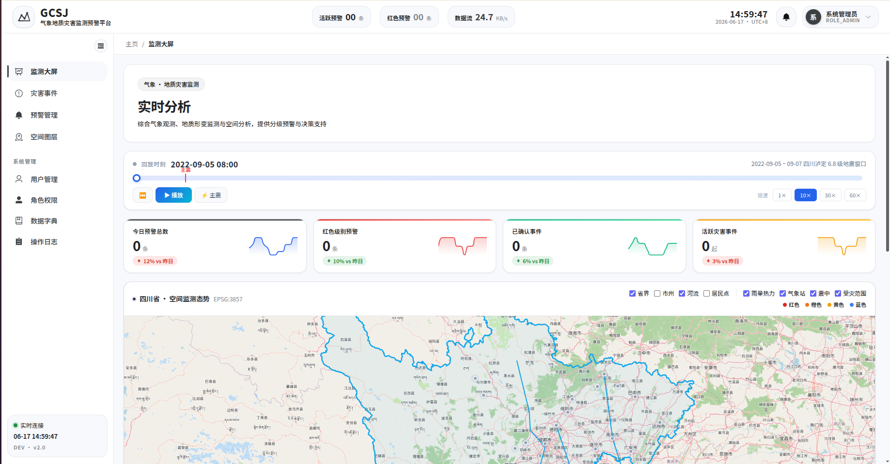
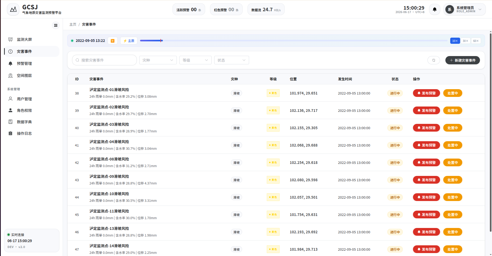
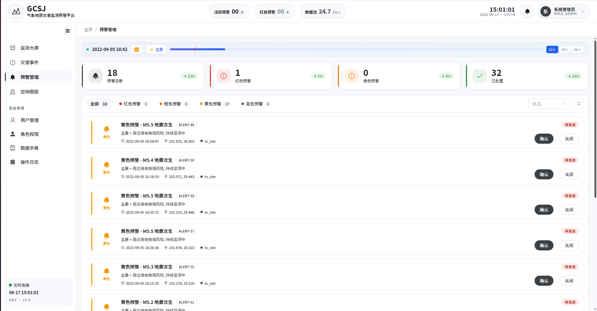
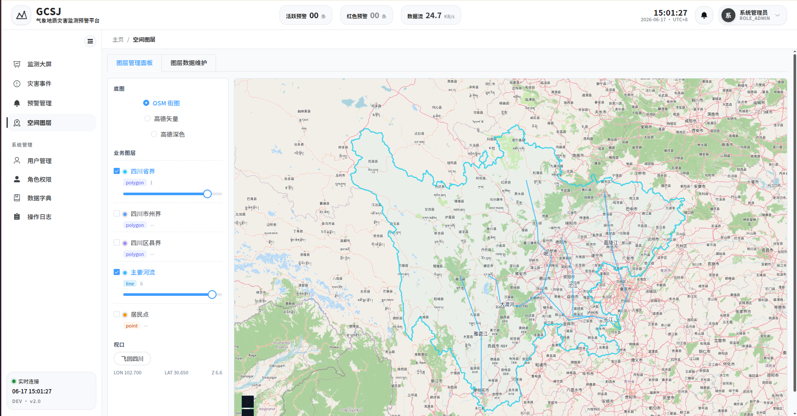
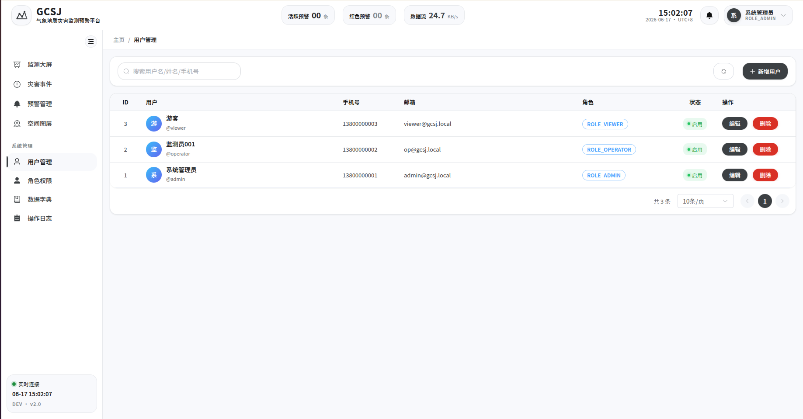
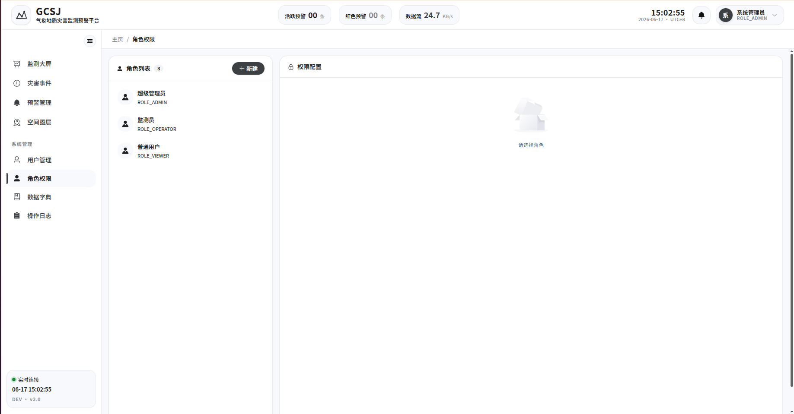
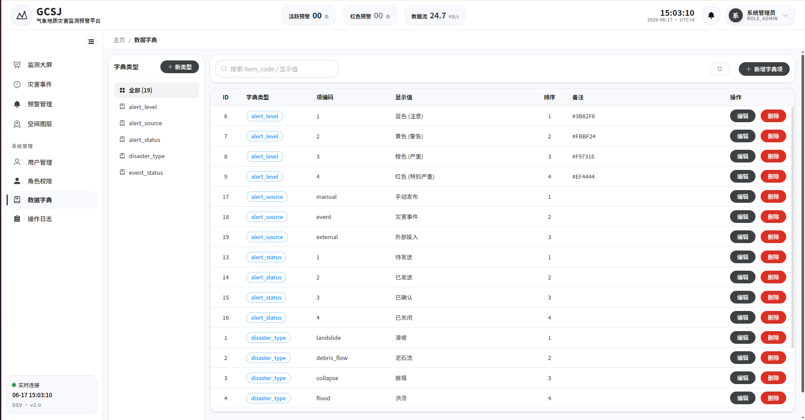
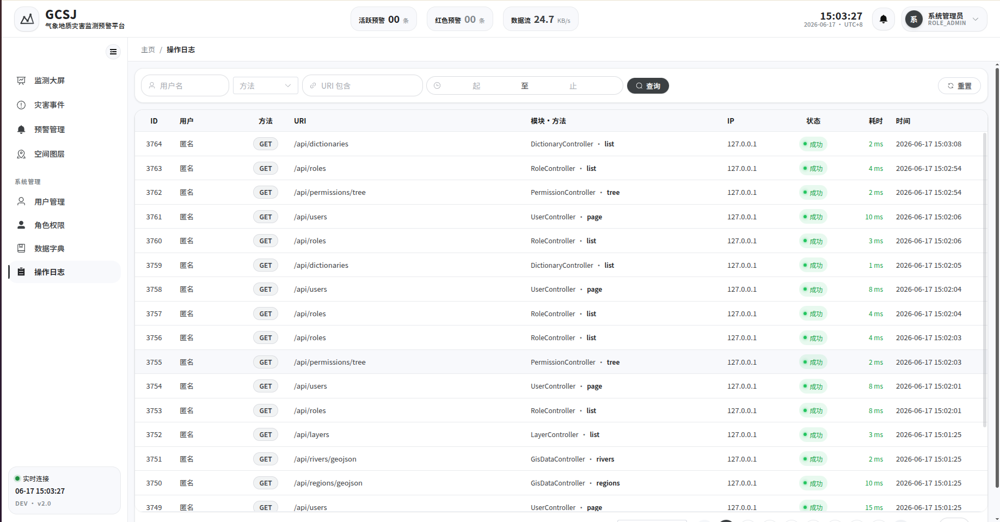

<div align="center">

# GCSJ-4 气象地质灾害监测预警管理系统

**基于 WebGIS 的气象地质灾害实时监测、风险评估与预警发布平台**

整合气象数据、地质监测数据与地理空间信息，对滑坡、泥石流、崩塌等地质灾害进行全流程监测预警。

---

### 技术栈


</div>

---

## 功能预览

### 登录鉴权

> 登录界面以 Google DeepMind WeatherNext 风格的气象热力图作为主视觉，渲染出"实时观测"的现场感。
>
> - 用户名 / 密码登录，后端签发 **JWT**（`POST /api/auth/login`）
> - 前端拦截器自动注入 `Authorization: Bearer <token>`，401 自动跳回登录
> - 角色 / 权限随 `GET /api/auth/profile` 一起返回，前端按权限控制路由与按钮

<div align="center">
   
</div>

### 监测大屏

> WebGIS 中央大屏 —— 一屏纵览灾害事件分布、预警等级、传感器布点与气象趋势。
>
> - 中央 OpenLayers 地图叠加灾害事件 / 预警 / 传感器 GeoJSON 图层
> - 左侧滚动播报 **最新预警**（`GET /api/alerts/latest`）与 **最新灾害事件**（`GET /api/disasters/latest`）
> - 右侧 ECharts 渲染雨量 / 位移等指标的实时折线
> - WebSocket（STOMP `/topic/alerts` `/topic/observations` `/topic/disasters`）推送增量，**无需刷新**即时刷新看板
> - 后端 `WeatherIngestJob` 每 60s 拉一次气象 API，落库即触发规则引擎

<div align="center">
  
</div>

### 灾害事件管理

> 灾害事件全生命周期闭环：登记 → 处置中 → 已结束，按灾种 / 等级 / 状态多维筛选。
>
> - 分页检索（`GET /api/disasters?level&type&status`），默认按发生时间倒序
> - 事件状态流转（`PATCH /api/disasters/{id}/status`）：1 进行中 / 2 处置中 / 3 已结束
> - 事件含 **影响区域 Polygon**，地图通过 `GET /api/disasters/geojson` 直接渲染
> - 灾害事件可一键派生预警（`POST /api/alerts/from-event/{eventId}`）

<div align="center">
  
</div>

### 预警发布

> 蓝 / 黄 / 橙 / 红 四级预警，覆盖创建 → 推送 → 确认 → 关闭全流程。
>
> - 手动创建（`POST /api/alerts`）或由事件派生（`POST /api/alerts/from-event/{eventId}`）
> - **多通道推送策略模式**：站内信 / 短信 / 邮件 通过 `Map<String, AlertDispatchStrategy>` 按 key 选择
> - 状态流转：`POST /api/alerts/{id}/confirm` 确认 → `POST /api/alerts/{id}/close` 关闭，留确认人 / 时间审计
> - 大屏 / 地图直接消费 `GET /api/alerts/latest` 与 `GET /api/alerts/geojson`

<div align="center">
  
</div>

### 空间图层管理

> 一站式管理 OpenLayers 业务图层 + 预留 **GeoServer 自动发布通道**。
>
> - "图层管理面板"：底图切换（OSM / 高德矢量 / 高德深色）、业务图层勾选、透明度滑杆、视口飞回四川
> - 内置图层：四川省 / 市州 / 区县三级行政界、主要河流、居民点（数据来自 `GET /api/regions|rivers|settlements/geojson`）
> - "图层数据维护"：CRUD 图层目录（`/api/layers`），支持 vector / raster / wms / wmts / xyz 五种数据源
> - **GeoServer 发布接口**已留口（`POST /api/layers/{id}/publish`），后续接入 GeoServer REST 后即可实现"前端填表 → 自动建工作区 / 数据存储 / 发布 PostGIS 表 / 绑定 SLD 样式"

<div align="center">
  
</div>

### 时间轴回放（2022·9·5 泸定 6.8 级地震）

> 离线生成的 9 月 5 日—7 日 72 小时模拟数据，按虚拟时刻播放雨情、地质传感、预警与事件演化。
>
> - 数据由 `spatial_analyse/replay_data_gen.py` 生成，规则引擎在 Python 端**离线**算好预警与事件
> - `GET /api/replay/window` 返回时间窗口、`/snapshot` 取某虚拟时刻的省域概览（雨强 / 活跃预警数 / 事件数）
> - `/weather/series` `/geo/series` 提供单站时序，`/alerts` `/events/geojson` `/earthquakes` 提供地图数据
> - 服务端故意走 `JdbcTemplate` 直查（不走 service / repository 三件套），换取查询性能

### 应急预案

> 灾害发生时按 **灾种 + 等级** 自动匹配适用预案，辅助处置决策。
>
> - 预案 CRUD（`/api/plans`），含编码 / 名称 / 灾种 / 等级 / 内容 / 附件 URL / 启停
> - 适用预案查询：`GET /api/plans/applicable?disasterType=...&level=...`

### 用户与角色权限

> 三级角色体系（**admin** 超管 / **operator** 监测员 / **viewer** 普通用户），细粒度按钮级 RBAC。
>
> - 用户分页 / 创建 / 更新 / 软删（`/api/users`），创建时分配 `roleIds`
> - 角色与权限树（`/api/roles` / `/api/permissions/tree`）
> - 前端 `v-permission` 指令 + 路由守卫双重控制

<div align="center">
  
</div>

<div align="center">
  
</div>

### 数据字典

> 按 `type` 分组维护键值项（灾害类型、预警等级、状态枚举等），全系统下拉统一来源。
>
> - `GET /api/dictionaries?type=` 按类型筛选 ， `GET /api/dictionaries/types` 列举所有类型

<div align="center">
  
</div>

### 操作日志（审计）

> 切面（`OperationLogAspect`）统一拦截写入，仅供审计检索。
>
> - `GET /api/logs?username&method&uri&from&to&page&size` 多条件分页，按时间倒序
> - 记录请求方法、URI、用户名、IP、耗时、状态码

<div align="center">
  
</div>

---

## 核心功能

| 模块 | 关键能力 | 主要接口 / 实现 |
|------|---------|----------------|
| 认证鉴权 | JWT 登录 / 当前用户信息 / 登出 | `POST /api/auth/login` · `JwtAuthenticationFilter` |
| 监测大屏 | 实时事件 / 预警 / 传感器叠加 + WebSocket 推送 | `/topic/alerts` · `/topic/observations` · `/topic/disasters` |
| 数据采集 | 气象 API 定时拉取（60s）/ 手动触发 | `WeatherIngestJob` · `POST /api/ingest/weather` |
| 实时监测 | 观测上报触发规则引擎、阈值检测、异常标记 | `POST /api/observations` · `/observations/series` |
| 预警发布 | 蓝/黄/橙/红 四级 + 多通道推送（站内/短信/邮件） | `POST /api/alerts` · 策略模式 `AlertDispatchStrategy` |
| 灾害事件 | 全生命周期 + 影响区域 Polygon + 派生预警 | `/api/disasters` · `PATCH /api/disasters/{id}/status` |
| WebGIS 可视化 | 底图切换 / 业务图层叠加 / 热力 / 灾害定位 | OpenLayers + ECharts，矢量切片预留 |
| 空间图层管理 | 图层目录 CRUD + GeoServer 自动发布通道（占位） | `/api/layers` · `POST /api/layers/{id}/publish` |
| 应急预案 | 按灾种+等级匹配适用预案 | `/api/plans` · `/api/plans/applicable` |
| 时间轴回放 | 泸定地震 72h 模拟数据时序回放 | `/api/replay/*` · `JdbcTemplate` 直查 |
| 系统管理 | 用户 / 角色 / 权限树 / 字典 / 操作日志 | `/api/users` · `/api/roles` · `/api/permissions/tree` · `/api/dictionaries` · `/api/logs` |

---

## 目录结构

```
.
├── frontend/        # Vue3 + Vite 前端工程
├── backend/         # Spring Boot 后端服务
├── gis/             # GeoServer 配置 / SLD 样式 / 切片脚本
├── docs/            # 设计文档 / 接口文档
├── deploy/          # Docker Compose 部署脚本
├── data/            # 示例数据 / init.sql
└── assert/          # 静态资源（截图等）
```

---

## 快速开始

> 团队约定：**没装 Docker 走「方式 A 本地直装」**，装了 Docker 的可走「方式 B」。两种方式建好的库连接参数完全一致，后端配置无需改动。

### 1️⃣ 数据库（PostgreSQL + PostGIS）

#### 方式 A · 本地直装（无 Docker，三系统通用）

<details>
<summary><b>🪟 Windows</b></summary>

1. 下载安装 PostgreSQL 16：<https://www.postgresql.org/download/windows/>
2. 安装末尾勾选 **Stack Builder**，在其中再勾选 **PostGIS Bundle** 一并装上
3. 打开「SQL Shell (psql)」或 pgAdmin，按下方"通用初始化"步骤执行

</details>

<details>
<summary><b>🍎 macOS</b></summary>

```bash
brew install postgresql@16 postgis
brew services start postgresql@16
```

</details>

<details>
<summary><b>🐧 Ubuntu / WSL</b></summary>

```bash
sudo apt update
sudo apt install -y postgresql-16 postgresql-16-postgis-3
sudo systemctl start postgresql
```

</details>

**通用初始化（任意系统装完 PG 后执行一次）**

```bash
# 1. 进入超级用户
sudo -u postgres psql       # Linux / macOS
# Windows 用 SQL Shell 直接登入 postgres

# 2. 在 psql 里依次执行
CREATE USER gcsj WITH PASSWORD 'gcsj123';
CREATE DATABASE gcsj OWNER gcsj;
\c gcsj
CREATE EXTENSION IF NOT EXISTS postgis;
\q

# 3. 导入初始化数据
psql -U gcsj -d gcsj -h localhost -f data/init.sql
```

**日常连接**

```bash
psql -U gcsj -d gcsj -h localhost
```

#### 方式 B · Docker（仅装了 Docker 的）

```bash
docker compose -f deploy/docker-compose.yml up -d postgres
docker exec -i gcsj-postgres psql -U gcsj -d gcsj < data/init.sql
```

> 镜像 `postgis/postgis:16-3.4` 已自带 PostGIS 扩展，无需手动 `CREATE EXTENSION`。

### 2️⃣ 后端

> 前置：JDK 17+、Maven 3.8+（项目自带 `mvnw`，无需全局安装 Maven）。

```bash
cd backend
./mvnw spring-boot:run -Dspring-boot.run.profiles=dev
# 服务: http://localhost:8085
# Swagger: http://localhost:8085/swagger-ui.html
```

### 3️⃣ 前端

> 前置：Node.js 18+ / npm（推荐使用 nvm 管理版本）。

```bash
cd frontend
npm install
npm run dev
# 访问: http://localhost:5173
```

### 4️⃣ 一键启动（仅 Docker 用户）

```bash
docker compose -f deploy/docker-compose.yml up -d
```

| 服务 | 地址 | 备注 |
|------|------|------|
| 前端 | http://localhost | 主入口 |
| 后端 API | http://localhost:8085 | RESTful + WebSocket |
| GeoServer | http://localhost:8600/geoserver | admin / gcsj123 |

> 没装 Docker ：按上面 1️⃣ 2️⃣ 3️⃣ 三步**分别在三个终端**启动数据库 / 后端 / 前端即可，开发期间不影响协作。

---

## 默认账号

| 用户名 | 密码 | 角色 |
|--------|------|------|
| `admin`    | `admin123` | 超级管理员 |
| `operator` | `admin123` | 监测员 |
| `viewer`   | `admin123` | 普通用户 |

---

## 配置

统一连接参数（`backend/src/main/resources/application-dev.yml`）：

| 项 | 值 |
|----|----|
| Host | `localhost` |
| Port | `5432` |
| Database | `gcsj` |
| User / Pass | `gcsj` / `gcsj123` |

可通过环境变量覆盖：`DB_HOST` / `DB_PORT` / `DB_NAME` / `WEATHER_API_KEY` / `MAP_TILE_KEY`。

---

## 约定

- **接口规范**：RESTful + 统一响应包裹 `{ code, message, data }`
- **空间数据**：矢量优先 GeoJSON，海量数据走矢量切片（MVT）
- **坐标系**：存储 EPSG:4326（WGS84），显示 EPSG:3857（Web Mercator）
- **预警配色**：🔵 蓝 `#3B82F6` · 🟡 黄 `#FBBF24` · 🟠 橙 `#F97316` · 🔴 红 `#EF4444`

---

## 数据库变更同步

`data/init.sql` 之外新增的脚本（如 `02_sichuan_schema.sql`）需要应用到现有库。下面 **A / B / C 三选一**，已有数据不会丢。

### A. 直接灌入（最快，推荐）

宿主机一行命令把脚本喂进容器内的 psql：

```bash
docker exec -i gcsj-postgres psql -U gcsj -d gcsj \
  -v ON_ERROR_STOP=1 \
  < data/02_sichuan_schema.sql
```

> `-v ON_ERROR_STOP=1` 让脚本遇错立刻中断，避免半成功。

### B. 拷进容器再交互执行（适合调试）

```bash
docker cp data/02_sichuan_schema.sql gcsj-postgres:/tmp/
docker exec -it gcsj-postgres psql -U gcsj -d gcsj
```

进入 psql 后：
```sql
gcsj=# \i /tmp/02_sichuan_schema.sql
gcsj=# \q
```

### C. 全新重建（会清空数据，仅首次部署用）

`compose` 里挂载到 `/docker-entrypoint-initdb.d/` 的 SQL **只在数据卷为空时执行**，所以要先 `down -v` 清卷：

```bash
docker compose -f deploy/docker-compose.db.yml down -v
docker compose -f deploy/docker-compose.db.yml up -d
```

### 验证脚本生效

```bash
docker exec -i gcsj-postgres psql -U gcsj -d gcsj -c "
SELECT 'rivers'      AS tbl, COUNT(*) FROM gis.gis_river      UNION ALL
SELECT 'settlements',         COUNT(*) FROM gis.gis_settlement UNION ALL
SELECT 'events',              COUNT(*) FROM biz.biz_disaster_event UNION ALL
SELECT 'alerts',              COUNT(*) FROM biz.biz_alert      UNION ALL
SELECT 'plans',               COUNT(*) FROM biz.biz_emergency_plan;"
```

期望：rivers=6 · settlements=23 · events=15 · alerts=4 · plans≥3。

### 行政区边界（Python 脚本，跑完上面再跑这步）

```bash
cd spatial_analyse
uv sync
uv run python ../data/load_sichuan_boundary.py    # 拉阿里 DataV → gis_admin_region
```

## 文档

- 系统总览：[`docs/*.md`](docs/*.md)
- 接口文档：启动后端访问 `/swagger-ui.html`
