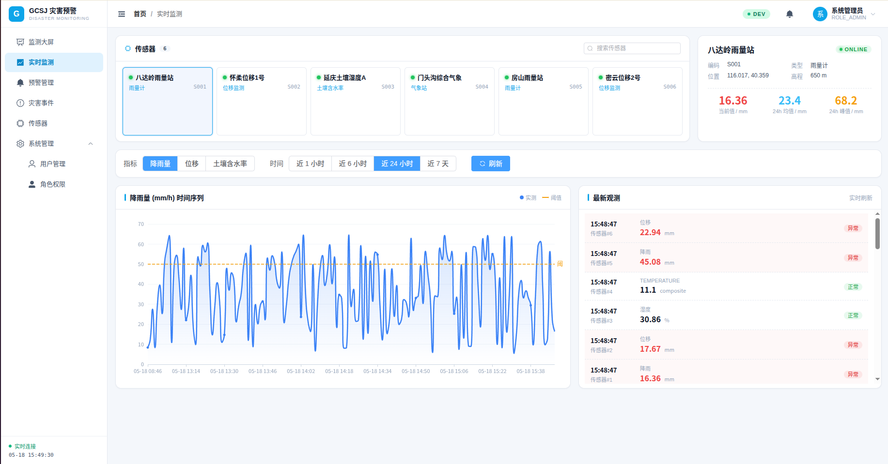
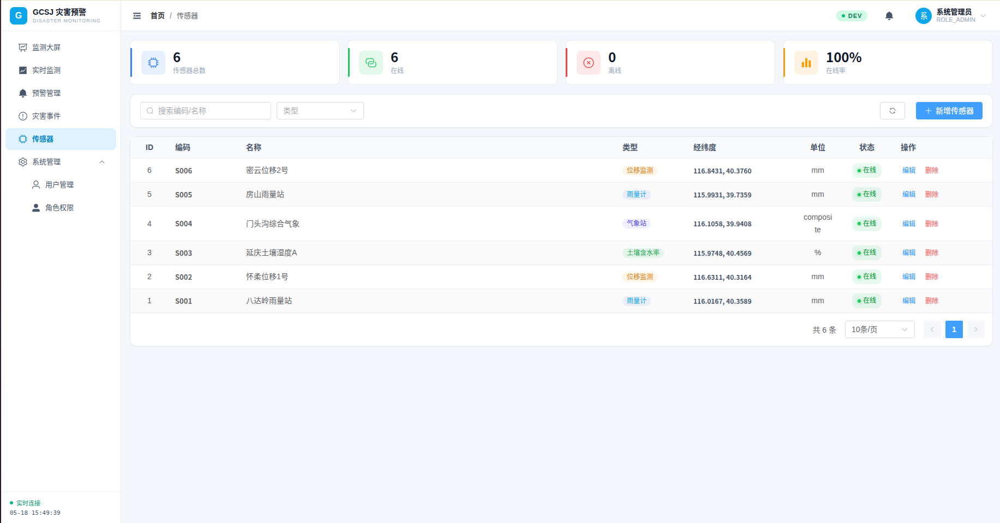
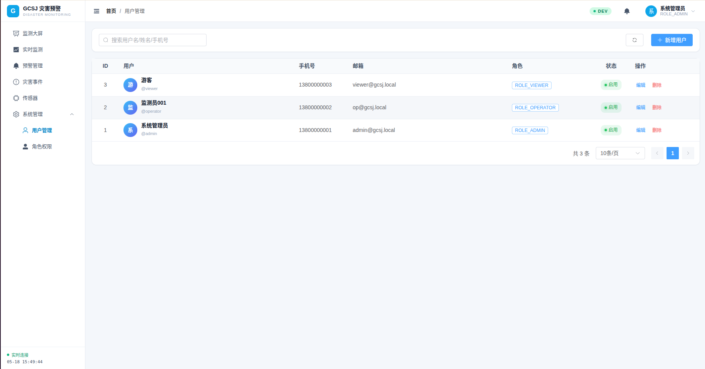

<div align="center">

# GCSJ-4 气象地质灾害监测预警管理系统

**基于 WebGIS 的气象地质灾害实时监测、风险评估与预警发布平台**

整合气象数据、地质监测数据与地理空间信息，对滑坡、泥石流、崩塌等地质灾害进行全流程监测预警。

---

### 技术栈


</div>

---

## 功能预览

### 监测大屏

> 一屏总览：实时灾害事件、预警等级、传感器分布与气象趋势。

<div align="center">
  
</div>

### 实时监测

> 多类型传感器（雨量、位移、土壤含水率、气象站）数据实时图表展示，支持多时间窗口切换。

<div align="center">
  
</div>

### 预警管理

> 蓝/黄/橙/红 四级预警分类、检索、确认与处置追踪。

<div align="center">
  
</div>

### 灾害事件

> 灾害事件全生命周期管理，按灾种 / 等级 / 位置 / 状态多维筛选。

<div align="center">
  
</div>

### 传感器管理

> 传感器在线率、设备类型、地理坐标统一纳管，支持新增 / 编辑 / 下线。

<div align="center">
  
</div>

### 用户与角色

> 三级角色体系（管理员 / 监测员 / 普通用户），细粒度按钮级权限控制。

<div align="center">
  
</div>

---

## 核心功能

| 模块 | 说明 |
|------|------|
| 数据采集与接入 | 对接气象 API / 传感器，统一写入空间数据库 |
| 实时监测 | 阈值检测、异常标记、WebSocket 实时推送 |
| 风险评估与预警 | 规则引擎分级生成蓝/黄/橙/红预警事件 |
| WebGIS 可视化 | 底图 / 专题图层 / 热力图 / 灾害点定位 |
| 灾害事件管理 | 事件登记、流转、处置闭环 |
| 系统管理 | 用户、角色、权限、组织、字典 |

---

## 目录结构

```
.
├── frontend/        # Vue3 + Vite 前端工程
├── backend/         # Spring Boot 后端服务
├── gis/             # GeoServer 配置 / SLD 样式 / 切片脚本
├── docs/            # 设计文档 / 接口文档
├── deploy/          # Docker Compose 部署脚本
├── data/            # 示例数据 / init.sql
└── assert/          # 静态资源（截图等）
```

---

## 快速开始

> 团队约定：**没装 Docker 走「方式 A 本地直装」**，装了 Docker 的可走「方式 B」。两种方式建好的库连接参数完全一致，后端配置无需改动。

### 1️⃣ 数据库（PostgreSQL + PostGIS）

#### 方式 A · 本地直装（无 Docker，三系统通用）

<details>
<summary><b>🪟 Windows</b></summary>

1. 下载安装 PostgreSQL 16：<https://www.postgresql.org/download/windows/>
2. 安装末尾勾选 **Stack Builder**，在其中再勾选 **PostGIS Bundle** 一并装上
3. 打开「SQL Shell (psql)」或 pgAdmin，按下方"通用初始化"步骤执行

</details>

<details>
<summary><b>🍎 macOS</b></summary>

```bash
brew install postgresql@16 postgis
brew services start postgresql@16
```

</details>

<details>
<summary><b>🐧 Ubuntu / WSL</b></summary>

```bash
sudo apt update
sudo apt install -y postgresql-16 postgresql-16-postgis-3
sudo systemctl start postgresql
```

</details>

**通用初始化（任意系统装完 PG 后执行一次）**

```bash
# 1. 进入超级用户
sudo -u postgres psql       # Linux / macOS
# Windows 用 SQL Shell 直接登入 postgres

# 2. 在 psql 里依次执行
CREATE USER gcsj WITH PASSWORD 'gcsj123';
CREATE DATABASE gcsj OWNER gcsj;
\c gcsj
CREATE EXTENSION IF NOT EXISTS postgis;
\q

# 3. 导入初始化数据
psql -U gcsj -d gcsj -h localhost -f data/init.sql
```

**日常连接**

```bash
psql -U gcsj -d gcsj -h localhost
```

#### 方式 B · Docker（仅装了 Docker 的）

```bash
docker compose -f deploy/docker-compose.yml up -d postgres
docker exec -i gcsj-postgres psql -U gcsj -d gcsj < data/init.sql
```

> 镜像 `postgis/postgis:16-3.4` 已自带 PostGIS 扩展，无需手动 `CREATE EXTENSION`。

### 2️⃣ 后端

> 前置：JDK 17+、Maven 3.8+（项目自带 `mvnw`，无需全局安装 Maven）。

```bash
cd backend
./mvnw spring-boot:run -Dspring-boot.run.profiles=dev
# 服务: http://localhost:8085
# Swagger: http://localhost:8085/swagger-ui.html
```

### 3️⃣ 前端

> 前置：Node.js 18+ / npm（推荐使用 nvm 管理版本）。

```bash
cd frontend
npm install
npm run dev
# 访问: http://localhost:5173
```

### 4️⃣ 一键启动（仅 Docker 用户）

```bash
docker compose -f deploy/docker-compose.yml up -d
```

| 服务 | 地址 | 备注 |
|------|------|------|
| 前端 | http://localhost | 主入口 |
| 后端 API | http://localhost:8085 | RESTful + WebSocket |
| GeoServer | http://localhost:8600/geoserver | admin / gcsj123 |

> 没装 Docker ：按上面 1️⃣ 2️⃣ 3️⃣ 三步**分别在三个终端**启动数据库 / 后端 / 前端即可，开发期间不影响协作。

---

## 默认账号

| 用户名 | 密码 | 角色 |
|--------|------|------|
| `admin`    | `admin123` | 超级管理员 |
| `operator` | `admin123` | 监测员 |
| `viewer`   | `admin123` | 普通用户 |

---

## 配置

统一连接参数（`backend/src/main/resources/application-dev.yml`）：

| 项 | 值 |
|----|----|
| Host | `localhost` |
| Port | `5432` |
| Database | `gcsj` |
| User / Pass | `gcsj` / `gcsj123` |

可通过环境变量覆盖：`DB_HOST` / `DB_PORT` / `DB_NAME` / `WEATHER_API_KEY` / `MAP_TILE_KEY`。

---

## 约定

- **接口规范**：RESTful + 统一响应包裹 `{ code, message, data }`
- **空间数据**：矢量优先 GeoJSON，海量数据走矢量切片（MVT）
- **坐标系**：存储 EPSG:4326（WGS84），显示 EPSG:3857（Web Mercator）
- **预警配色**：🔵 蓝 `#3B82F6` · 🟡 黄 `#FBBF24` · 🟠 橙 `#F97316` · 🔴 红 `#EF4444`

---

## 文档

- 系统总览：[`docs/*.md`](docs/*.md)
- 接口文档：启动后端访问 `/swagger-ui.html`
