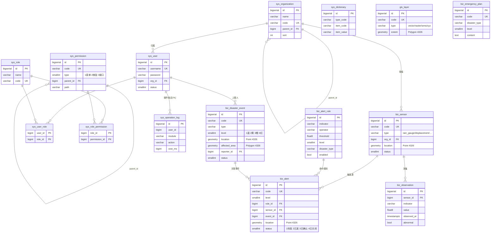

# GCSJ-4 数据库表结构分析

> 数据源: [data/init.sql](../data/init.sql)
> 数据库: PostgreSQL 16 + PostGIS 3.4 (WGS84 / EPSG:4326)

## 一、表清单与分组

按业务职责将 15 张表划分为 4 个域:

| 域 | 表名 | 说明 |
|---|---|---|
| **系统域 (sys_)** | `sys_organization` | 组织机构(树形,自引用 `parent_id`) |
| | `sys_user` | 系统用户,挂在组织下 |
| | `sys_role` | 角色 |
| | `sys_permission` | 权限/菜单(树形,自引用 `parent_id`) |
| | `sys_user_role` | 用户↔角色 多对多关联 |
| | `sys_role_permission` | 角色↔权限 多对多关联 |
| | `sys_dictionary` | 数据字典(`disaster_type` / `alert_level` / `sensor_type`) |
| | `sys_operation_log` | 操作日志(冗余 `username`,无外键约束) |
| **GIS 域** | `gis_layer` | 业务图层目录,`extent` 为 Polygon |
| **监测域 (biz_sensor/observation)** | `biz_sensor` | 监测传感器,`location` 为 Point |
| | `biz_observation` | 观测数据(指标-值-时间) |
| **预警与灾害域** | `biz_disaster_event` | 灾害事件,带 `location` Point + `affected_area` Polygon |
| | `biz_alert_rule` | 预警规则(指标 + 操作符 + 阈值 + 等级) |
| | `biz_alert` | 预警事件,可关联 rule / sensor / event |
| | `biz_emergency_plan` | 应急预案,按灾害类型与等级匹配 |

## 二、关键关系

- **RBAC 闭环**: `sys_user` ─〈`sys_user_role`〉─ `sys_role` ─〈`sys_role_permission`〉─ `sys_permission`
- **组织从属**: `sys_user.org_id` / `biz_sensor.org_id` → `sys_organization.id`
- **监测数据链**: `biz_sensor` ─1:N→ `biz_observation`
- **预警触发链**: `biz_alert_rule` + `biz_sensor` ─→ `biz_alert` ─(可选)→ `biz_disaster_event`
- **空间字段**: 5 张表使用 PostGIS,均建了 GIST 索引
  - Point: `biz_sensor.location` / `biz_disaster_event.location` / `biz_alert.location`
  - Polygon: `gis_layer.extent` / `biz_disaster_event.affected_area`

## 三、ER 图

## 四、设计观察

1. **软删除统一**: 业务表(除关联表/日志/字典)都带 `deleted` 标志和 `created_at` / `updated_at`,适合统一拦截器处理。
2. **关联表无独立审计字段**: `sys_user_role` / `sys_role_permission` 仅做联合主键,无法追溯授权时间——若有审计需求需扩展。
3. **`sys_operation_log` 与 `sys_user` 解耦**: 仅冗余 `user_id` / `username` 字段而无 FK,这样用户被删除时日志仍保留,符合审计场景。
4. **预警冗余位置**: `biz_alert.location` 在已关联 `sensor_id` / `event_id` 的情况下仍冗余存储 Point,目的是即使源数据被删/隐藏,预警地图层仍可独立渲染。
5. **字典 vs 枚举**: `disaster_type` / `sensor_type` / `alert_level` 既在 `sys_dictionary` 里定义,又散落在 `biz_*` 表的 VARCHAR 字段中——前端展示走字典,业务校验需要保持一致。
