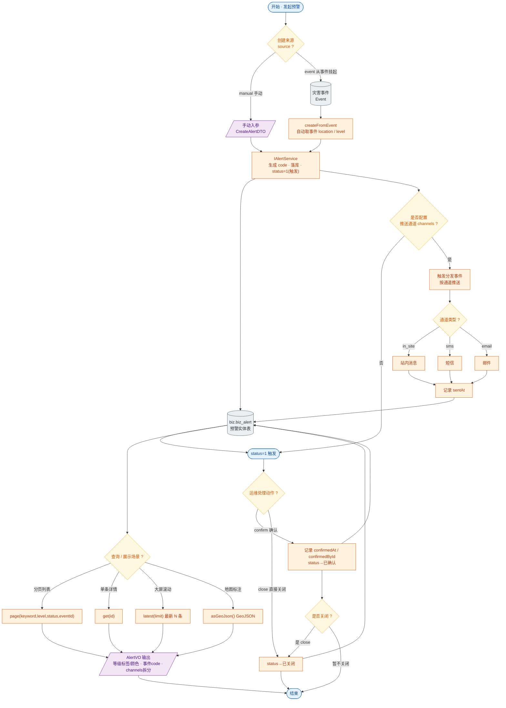

# 接口文档 · AlertController（预警事件）

> 说明：本文档为接口文档的统一格式范本。后续其他 Controller 模块均按此结构编写。
>
> - 基础路径（@RequestMapping）：`/api/alerts`
> - 统一返回包装：`Result<T>`（业务码 + 数据），分页返回 `Result<PageResult<T>>`
> - 对应服务：`IAlertService`

---

## 一、Controller 功能表

| 类功能 | Alert 功能（预警事件的创建、查询、状态流转与大屏/地图展示） |
| --- | --- |
| **方法一** | `create(CreateAlertDTO)` |
| | 功能：手动创建一条预警，并触发分发事件（站内/短信/邮件推送） |
| | 输入：请求体 `CreateAlertDTO`（title、content、level、eventId、source、经纬度、channels） |
| | 输出：`Result<AlertVO>` —— 新建后的预警详情 |
| | 路由：`POST /api/alerts` |
| **方法二** | `createFromEvent(Long eventId, Short level, String title, String content, List<String> channels)` |
| | 功能：从已有灾害事件挂起预警（source=event，自动取事件的 location/level） |
| | 输入：路径参数 `eventId`；查询参数 `level`、`title`、`content`、`channels`（均可空，缺省时取事件值） |
| | 输出：`Result<AlertVO>` —— 由事件派生出的预警详情 |
| | 路由：`POST /api/alerts/from-event/{eventId}` |
| **方法三** | `page(String keyword, Short level, Short status, Long eventId, int page, int size)` |
| | 功能：按条件分页查询预警列表，默认按触发时间倒序 |
| | 输入：查询参数 `keyword`、`level`、`status`、`eventId`（均可空）；`page`（默认 1）、`size`（默认 10） |
| | 输出：`Result<PageResult<AlertVO>>` —— 分页结果（列表 + 总数等） |
| | 路由：`GET /api/alerts` |
| **方法四** | `get(Long id)` |
| | 功能：查询单条预警详情 |
| | 输入：路径参数 `id` |
| | 输出：`Result<AlertVO>` —— 预警详情 |
| | 路由：`GET /api/alerts/{id}` |
| **方法五** | `confirm(Long id)` |
| | 功能：确认预警（状态流转为已确认，记录确认时间/确认人） |
| | 输入：路径参数 `id` |
| | 输出：`Result<AlertVO>` —— 确认后的预警详情 |
| | 路由：`POST /api/alerts/{id}/confirm` |
| **方法六** | `close(Long id)` |
| | 功能：关闭预警（状态流转为已关闭） |
| | 输入：路径参数 `id` |
| | 输出：`Result<AlertVO>` —— 关闭后的预警详情 |
| | 路由：`POST /api/alerts/{id}/close` |
| **方法七** | `latest(int limit)` |
| | 功能：取最新 N 条预警，供大屏左侧滚动展示 |
| | 输入：查询参数 `limit`（默认 10） |
| | 输出：`Result<List<AlertVO>>` —— 最新预警列表 |
| | 路由：`GET /api/alerts/latest` |
| **方法八** | `asGeoJson()` |
| | 功能：输出预警的 GeoJSON，供地图图标标注 |
| | 输入：无 |
| | 输出：`Result<Map<String,Object>>` —— GeoJSON（FeatureCollection 结构） |
| | 路由：`GET /api/alerts/geojson` |

---

## 二、功能流程结构图

> 形状约定（便于导入 iodraw / draw.io 等工具）：圆角=开始/结束，矩形=处理步骤，**棱形=判断/分支**，平行四边形=输入/输出，圆柱=数据存储。

---

## 三、Entity 实体表 · Alert（表 `biz.biz_alert`）

> 继承 `BaseEntity` 公共基类，包含主键、软删除、创建/更新时间。

| 字段 | 类型 | 列名 / 约束 | 说明 |
| --- | --- | --- | --- |
| id | Long | 主键，自增 | 实体主键（继承自 BaseEntity） |
| deleted | Boolean | `deleted`，默认 false | 软删除标记（继承自 BaseEntity） |
| createdAt | OffsetDateTime | `created_at`，不可更新 | 创建时间（继承自 BaseEntity） |
| updatedAt | OffsetDateTime | `updated_at` | 更新时间（继承自 BaseEntity） |
| code | String | `code`，唯一、非空、长度 64 | 预警编号 |
| title | String | `title`，非空、长度 256 | 预警标题 |
| content | String | text | 预警内容 |
| level | Short | 非空 | 预警等级（1~4） |
| eventId | Long | `event_id` | 关联灾害事件 id（可空） |
| source | String | 长度 64 | 来源：manual / event / external |
| location | Point | `geometry(Point, 4326)` | 经纬度坐标（PostGIS 点） |
| channels | String | 长度 128 | 推送通道，逗号分隔串（in_site/sms/email） |
| status | Short | 非空，默认 1 | 状态：1 触发 / 已确认 / 已关闭等 |
| triggeredAt | OffsetDateTime | `triggered_at`，非空 | 触发时间 |
| sentAt | OffsetDateTime | `sent_at` | 发送时间 |
| confirmedAt | OffsetDateTime | `confirmed_at` | 确认时间 |
| confirmedById | Long | `confirmed_by_id` | 确认人 id |

---

## 四、关联 DTO / VO

### 入参 · CreateAlertDTO（创建预警请求体）

| 字段 | 类型 | 校验 | 说明 |
| --- | --- | --- | --- |
| title | String | `@NotBlank` | 预警标题，必填 |
| content | String | — | 预警内容 |
| level | Short | `@NotNull` `@Min(1) @Max(4)` | 预警等级 1~4，必填 |
| eventId | Long | — | 关联灾害事件 id（可空，手动发布时填） |
| source | String | `@Pattern(manual\|event\|external)` | 来源，默认 manual |
| longitude | Double | — | 经度 |
| latitude | Double | — | 纬度 |
| channels | List\<String\> | — | 推送通道：in_site / sms / email |

### 出参 · AlertVO（预警视图对象）

| 字段 | 类型 | 说明 |
| --- | --- | --- |
| id | Long | 预警 id |
| code | String | 预警编号 |
| title | String | 标题 |
| content | String | 内容 |
| level | Short | 等级（1~4） |
| levelLabel | String | 等级文字标签 |
| levelColor | String | 等级颜色（前端展示用） |
| eventId | Long | 关联事件 id |
| eventCode | String | 关联事件编号（便于前端表格直接展示） |
| source | String | 来源：manual / event / external |
| longitude | Double | 经度 |
| latitude | Double | 纬度 |
| channels | List\<String\> | 通道列表（由 entity 逗号串拆分而来） |
| status | Short | 状态 |
| triggeredAt | OffsetDateTime | 触发时间 |
| sentAt | OffsetDateTime | 发送时间 |
| confirmedAt | OffsetDateTime | 确认时间 |
| confirmedById | Long | 确认人 id |
