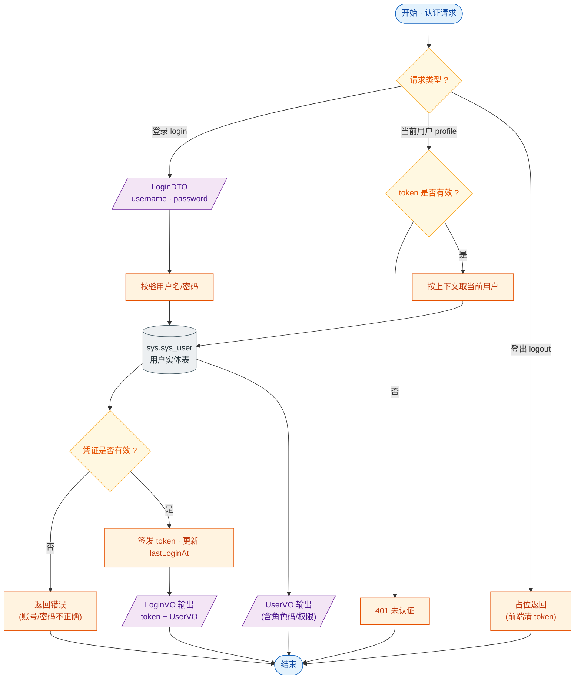

# 接口文档 · AuthController（认证）

> 遵循《接口文档生成规范》。
>
> - 基础路径（@RequestMapping）：`/api/auth`
> - 统一返回包装：`Result<T>`
> - 对应服务：`IUserService`（认证与用户共用同一服务）
> - 业务定位：登录鉴权与当前用户信息获取，公开接口（登录）与鉴权接口（profile）混合。

---

## 一、Controller 功能表

| 类功能 | Auth 功能（登录、获取当前登录用户、登出占位） |
| --- | --- |
| **方法一** | `login(LoginDTO)` |
| | 功能：用户名密码登录，校验通过后签发 token |
| | 输入：请求体 `LoginDTO`（username、password） |
| | 输出：`Result<LoginVO>` —— token + 用户信息（UserVO） |
| | 路由：`POST /api/auth/login` |
| **方法二** | `profile()` |
| | 功能：获取当前登录用户信息（从鉴权上下文取） |
| | 输入：无（依赖请求头中的 token） |
| | 输出：`Result<UserVO>` —— 当前用户详情（含角色码、权限） |
| | 路由：`GET /api/auth/profile` |
| **方法三** | `logout()` |
| | 功能：登出（前端清 token 即可，此处仅占位） |
| | 输入：无 |
| | 输出：`Result<Void>` —— 空数据，仅业务码 |
| | 路由：`POST /api/auth/logout` |

---

## 二、功能流程结构图

> 形状约定：圆角=开始/结束，矩形=处理，**棱形=判断/分支**，平行四边形=输入/输出，圆柱=数据存储。

---

## 三、Entity 实体表

> AuthController 不持有独立实体，复用 **User**（表 `sys.sys_user`）。完整字段见《接口文档-UserController.md》第三节。认证主要涉及的字段：

| 字段 | 类型 | 说明 |
| --- | --- | --- |
| username | String | 登录用户名（唯一） |
| password | String | 密码（加密存储，登录时比对） |
| status | Short | 账号状态（禁用时拒绝登录） |
| lastLoginAt | OffsetDateTime | 登录成功后更新 |

---

## 四、关联 DTO / VO

### 入参 · LoginDTO（登录请求体）

| 字段 | 类型 | 校验 | 说明 |
| --- | --- | --- | --- |
| username | String | `@NotBlank` `@Size(3,64)` | 用户名，必填 |
| password | String | `@NotBlank` `@Size(6,64)` | 密码，必填 |

### 出参 · LoginVO（登录结果）

| 字段 | 类型 | 说明 |
| --- | --- | --- |
| token | String | 鉴权令牌，后续请求放入请求头 |
| user | UserVO | 登录用户信息（结构见下） |

### 出参 · UserVO（用户视图对象，profile 与 login 共用）

| 字段 | 类型 | 说明 |
| --- | --- | --- |
| id | Long | 用户 id |
| username | String | 用户名 |
| realName | String | 真实姓名 |
| phone | String | 手机号 |
| email | String | 邮箱 |
| avatar | String | 头像 URL |
| status | Short | 状态 |
| lastLoginAt | OffsetDateTime | 最近登录时间 |
| createdAt | OffsetDateTime | 创建时间 |
| roleCodes | List\<String\> | 角色编码列表 |
| permissions | List\<String\> | 权限列表 |
