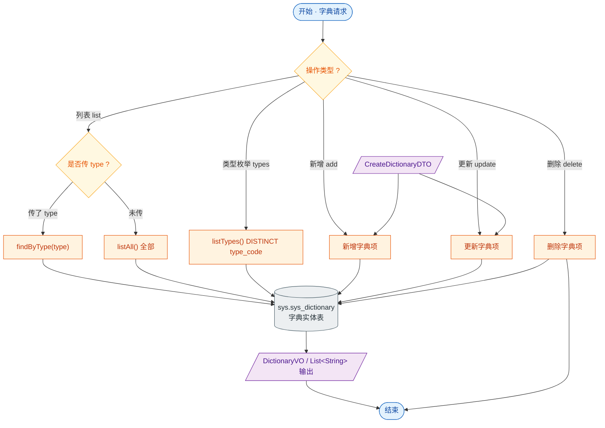

# 接口文档 · DictionaryController（字典）

> 遵循《接口文档生成规范》。
>
> - 基础路径（@RequestMapping）：`/api/dictionaries`
> - 统一返回包装：`Result<T>`
> - 对应服务：`IDictionaryService`
> - 业务定位：数据字典维护——按类型分组的键值项（如灾害类型、状态枚举等），供全系统下拉/枚举展示。

---

## 一、Controller 功能表

| 类功能 | Dictionary 功能（字典项列表、类型枚举、增改删） |
| --- | --- |
| **方法一** | `list(String type)` |
| | 功能：字典列表，按 type 筛选；不传 type 返回全部 |
| | 输入：查询参数 `type`（可空） |
| | 输出：`Result<List<DictionaryVO>>` —— 字典项列表 |
| | 路由：`GET /api/dictionaries` |
| **方法二** | `types()` |
| | 功能：返回全部字典类型（DISTINCT type_code） |
| | 输入：无 |
| | 输出：`Result<List<String>>` —— 类型编码列表 |
| | 路由：`GET /api/dictionaries/types` |
| **方法三** | `add(CreateDictionaryDTO)` |
| | 功能：新增字典项 |
| | 输入：请求体 `CreateDictionaryDTO`（typeCode、itemCode、itemValue、sort、description） |
| | 输出：`Result<DictionaryVO>` —— 新建后的字典项 |
| | 路由：`POST /api/dictionaries` |
| **方法四** | `update(Long id, CreateDictionaryDTO)` |
| | 功能：更新字典项 |
| | 输入：路径参数 `id`；请求体 `CreateDictionaryDTO` |
| | 输出：`Result<DictionaryVO>` —— 更新后的字典项 |
| | 路由：`PUT /api/dictionaries/{id}` |
| **方法五** | `delete(Long id)` |
| | 功能：删除字典项 |
| | 输入：路径参数 `id` |
| | 输出：`Result<Void>` —— 空数据，仅业务码 |
| | 路由：`DELETE /api/dictionaries/{id}` |

---

## 二、功能流程结构图

> 形状约定：圆角=开始/结束，矩形=处理，**棱形=判断/分支**，平行四边形=输入/输出，圆柱=数据存储。

---

## 三、Entity 实体表 · Dictionary（表 `sys.sys_dictionary`）

> 注：本实体**未继承** BaseEntity，仅含自身主键 id，无软删除/审计字段。

| 字段 | 类型 | 列名 / 约束 | 说明 |
| --- | --- | --- | --- |
| id | Long | 主键，自增 | 主键 |
| typeCode | String | `type_code`，非空、长度 64 | 字典类型编码 |
| itemCode | String | `item_code`，非空、长度 64 | 字典项编码 |
| itemValue | String | `item_value`，非空、长度 128 | 字典项显示值 |
| sort | Integer | 非空，默认 0 | 排序值 |
| description | String | 长度 256 | 描述 |

---

## 四、关联 DTO / VO

### 入参 · CreateDictionaryDTO（创建/更新字典项请求体）

| 字段 | 类型 | 校验 | 说明 |
| --- | --- | --- | --- |
| typeCode | String | `@NotBlank` `@Size(max=64)` | 字典类型编码，必填 |
| itemCode | String | `@NotBlank` `@Size(max=64)` | 字典项编码，必填 |
| itemValue | String | `@NotBlank` `@Size(max=128)` | 字典项显示值，必填 |
| sort | Integer | — | 排序值，默认 0 |
| description | String | `@Size(max=256)` | 描述 |

### 出参 · DictionaryVO（字典视图对象）

| 字段 | 类型 | 说明 |
| --- | --- | --- |
| id | Long | 字典项 id |
| typeCode | String | 字典类型编码 |
| itemCode | String | 字典项编码 |
| itemValue | String | 字典项显示值 |
| sort | Integer | 排序值 |
| description | String | 描述 |
