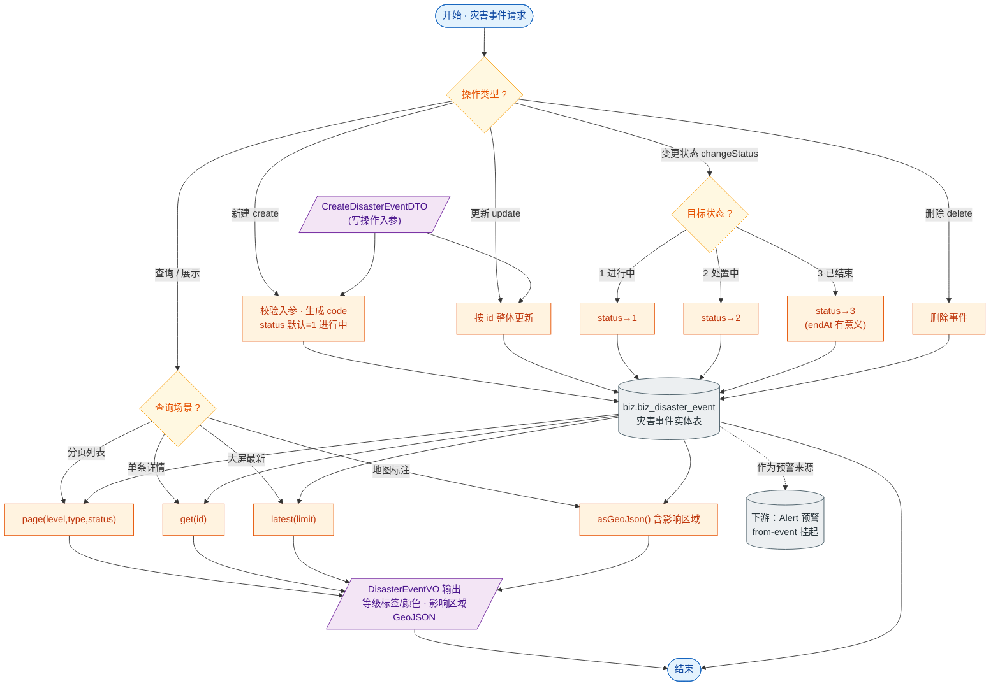

# 接口文档 · DisasterEventController（灾害事件）

> 遵循《接口文档生成规范》。
>
> - 基础路径（@RequestMapping）：`/api/disasters`
> - 统一返回包装：`Result<T>`；分页返回 `Result<PageResult<T>>`
> - 对应服务：`IDisasterEventService`
> - 业务定位：灾害事件的全生命周期管理（建/查/改/状态流转/删），并向大屏与地图提供最新列表与 GeoJSON；是预警（Alert）的上游来源。

---

## 一、Controller 功能表

| 类功能 | DisasterEvent 功能（灾害事件的增删改查、状态流转，及大屏/地图数据输出） |
| --- | --- |
| **方法一** | `page(Short level, String type, Short status, int page, int size)` |
| | 功能：按等级/类型/状态分页查询灾害事件，默认按发生时间倒序 |
| | 输入：查询参数 `level`、`type`、`status`（均可空）；`page`（默认 1）、`size`（默认 10） |
| | 输出：`Result<PageResult<DisasterEventVO>>` —— 分页结果 |
| | 路由：`GET /api/disasters` |
| **方法二** | `get(Long id)` |
| | 功能：查询单条灾害事件详情 |
| | 输入：路径参数 `id` |
| | 输出：`Result<DisasterEventVO>` —— 事件详情 |
| | 路由：`GET /api/disasters/{id}` |
| **方法三** | `create(CreateDisasterEventDTO)` |
| | 功能：新建灾害事件 |
| | 输入：请求体 `CreateDisasterEventDTO`（title、type、level、经纬度、影响区域、发生时间等） |
| | 输出：`Result<DisasterEventVO>` —— 新建后的事件详情 |
| | 路由：`POST /api/disasters` |
| **方法四** | `update(Long id, CreateDisasterEventDTO)` |
| | 功能：更新灾害事件（整体更新，复用创建 DTO） |
| | 输入：路径参数 `id`；请求体 `CreateDisasterEventDTO` |
| | 输出：`Result<DisasterEventVO>` —— 更新后的事件详情 |
| | 路由：`PUT /api/disasters/{id}` |
| **方法五** | `changeStatus(Long id, Short status)` |
| | 功能：变更事件状态（1 进行中 / 2 处置中 / 3 已结束） |
| | 输入：路径参数 `id`；查询参数 `status` |
| | 输出：`Result<DisasterEventVO>` —— 状态变更后的事件详情 |
| | 路由：`PATCH /api/disasters/{id}/status` |
| **方法六** | `delete(Long id)` |
| | 功能：删除灾害事件 |
| | 输入：路径参数 `id` |
| | 输出：`Result<Void>` —— 空数据，仅业务码 |
| | 路由：`DELETE /api/disasters/{id}` |
| **方法七** | `latest(int limit)` |
| | 功能：取最新事件，供大屏展示 |
| | 输入：查询参数 `limit`（默认 10） |
| | 输出：`Result<List<DisasterEventVO>>` —— 最新事件列表 |
| | 路由：`GET /api/disasters/latest` |
| **方法八** | `asGeoJson()` |
| | 功能：输出灾害事件 GeoJSON（含影响区域 Polygon），供地图渲染 |
| | 输入：无 |
| | 输出：`Result<Map<String,Object>>` —— GeoJSON（FeatureCollection） |
| | 路由：`GET /api/disasters/geojson` |

---

## 二、功能流程结构图

> 形状约定：圆角=开始/结束，矩形=处理，**棱形=判断/分支**，平行四边形=输入/输出，圆柱=数据存储。

---

## 三、Entity 实体表 · DisasterEvent（表 `biz.biz_disaster_event`）

> 继承 `BaseEntity`：id / deleted / createdAt / updatedAt。

| 字段 | 类型 | 列名 / 约束 | 说明 |
| --- | --- | --- | --- |
| id | Long | 主键，自增 | 主键（继承 BaseEntity） |
| deleted | Boolean | `deleted`，默认 false | 软删除标记（继承 BaseEntity） |
| createdAt | OffsetDateTime | `created_at`，不可更新 | 创建时间（继承 BaseEntity） |
| updatedAt | OffsetDateTime | `updated_at` | 更新时间（继承 BaseEntity） |
| code | String | `code`，唯一、非空、长度 64 | 事件编号 |
| title | String | 非空、长度 256 | 事件标题 |
| type | String | 非空、长度 32 | 灾害类型 |
| level | Short | 非空 | 等级（1~4） |
| location | Point | 非空，`geometry(Point,4326)` | 事发点坐标（PostGIS） |
| affectedArea | Polygon | `affected_area`，`geometry(Polygon,4326)` | 影响区域多边形（可空） |
| occurredAt | OffsetDateTime | `occurred_at`，非空 | 发生时间 |
| endAt | OffsetDateTime | `end_at` | 结束时间（status=3 时有意义） |
| status | Short | 非空，默认 1 | 状态：1 进行中 / 2 处置中 / 3 已结束 |
| description | String | text | 事件描述 |
| reporterId | Long | `reporter_id` | 上报人 id |

---

## 四、关联 DTO / VO

### 入参 · CreateDisasterEventDTO（创建/更新事件请求体）

| 字段 | 类型 | 校验 | 说明 |
| --- | --- | --- | --- |
| title | String | `@NotBlank` | 事件标题，必填 |
| type | String | `@NotBlank` | 灾害类型，必填 |
| level | Short | `@NotNull` `@Min(1) @Max(4)` | 等级 1~4，必填 |
| longitude | Double | `@NotNull` | 经度，必填 |
| latitude | Double | `@NotNull` | 纬度，必填 |
| affectedAreaGeoJson | String | — | 影响区域 GeoJSON Polygon，可选 |
| occurredAt | OffsetDateTime | `@NotNull` | 发生时间，必填 |
| description | String | — | 事件描述 |
| status | Short | `@Min(1) @Max(3)` | 1 进行中 / 2 处置中 / 3 已结束，不传按 1 |
| endAt | OffsetDateTime | — | 仅 status=3 时有意义 |

### 出参 · DisasterEventVO（灾害事件视图对象）

| 字段 | 类型 | 说明 |
| --- | --- | --- |
| id | Long | 事件 id |
| code | String | 事件编号 |
| title | String | 标题 |
| type | String | 灾害类型 |
| level | Short | 等级（1~4） |
| levelLabel | String | 等级文字标签 |
| levelColor | String | 等级颜色（前端展示用） |
| longitude | Double | 经度 |
| latitude | Double | 纬度 |
| affectedAreaGeoJson | String | 影响区域 GeoJSON（前端 OpenLayers 直接 read） |
| occurredAt | OffsetDateTime | 发生时间 |
| endAt | OffsetDateTime | 结束时间 |
| status | Short | 状态（1/2/3） |
| description | String | 事件描述 |
| reporterId | Long | 上报人 id |
| createdAt | OffsetDateTime | 创建时间 |
