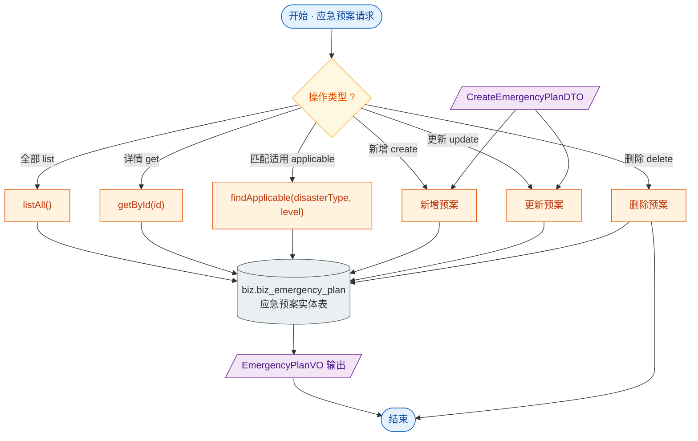

# 接口文档 · EmergencyPlanController（应急预案）

> 遵循《接口文档生成规范》。
>
> - 基础路径（@RequestMapping）：`/api/plans`
> - 统一返回包装：`Result<T>`
> - 对应服务：`IEmergencyPlanService`
> - 业务定位：应急预案的增删改查，并支持按灾种+等级匹配适用预案，为灾害处置提供预案支撑。

---

## 一、Controller 功能表

| 类功能 | EmergencyPlan 功能（预案列表、详情、增改删，及按灾种/等级匹配适用预案） |
| --- | --- |
| **方法一** | `list()` |
| | 功能：查询全部预案 |
| | 输入：无 |
| | 输出：`Result<List<EmergencyPlanVO>>` —— 预案列表 |
| | 路由：`GET /api/plans` |
| **方法二** | `get(Long id)` |
| | 功能：查询预案详情 |
| | 输入：路径参数 `id` |
| | 输出：`Result<EmergencyPlanVO>` —— 预案详情 |
| | 路由：`GET /api/plans/{id}` |
| **方法三** | `create(CreateEmergencyPlanDTO)` |
| | 功能：新增预案 |
| | 输入：请求体 `CreateEmergencyPlanDTO`（code、name、disasterType、level、content、fileUrl、enabled） |
| | 输出：`Result<EmergencyPlanVO>` —— 新建后的预案 |
| | 路由：`POST /api/plans` |
| **方法四** | `update(Long id, CreateEmergencyPlanDTO)` |
| | 功能：更新预案（复用创建 DTO） |
| | 输入：路径参数 `id`；请求体 `CreateEmergencyPlanDTO` |
| | 输出：`Result<EmergencyPlanVO>` —— 更新后的预案 |
| | 路由：`PUT /api/plans/{id}` |
| **方法五** | `delete(Long id)` |
| | 功能：删除预案 |
| | 输入：路径参数 `id` |
| | 输出：`Result<Void>` —— 空数据，仅业务码 |
| | 路由：`DELETE /api/plans/{id}` |
| **方法六** | `applicable(String disasterType, Short level)` |
| | 功能：查找适用预案（按灾种 + 等级匹配） |
| | 输入：查询参数 `disasterType`、`level`（均必填） |
| | 输出：`Result<List<EmergencyPlanVO>>` —— 匹配的预案列表 |
| | 路由：`GET /api/plans/applicable` |

---

## 二、功能流程结构图

> 形状约定：圆角=开始/结束，矩形=处理，**棱形=判断/分支**，平行四边形=输入/输出，圆柱=数据存储。

---

## 三、Entity 实体表 · EmergencyPlan（表 `biz.biz_emergency_plan`）

> 继承 `BaseEntity`：id / deleted / createdAt / updatedAt。

| 字段 | 类型 | 列名 / 约束 | 说明 |
| --- | --- | --- | --- |
| id | Long | 主键，自增 | 主键（继承 BaseEntity） |
| deleted | Boolean | `deleted`，默认 false | 软删除标记（继承 BaseEntity） |
| createdAt | OffsetDateTime | `created_at`，不可更新 | 创建时间（继承 BaseEntity） |
| updatedAt | OffsetDateTime | `updated_at` | 更新时间（继承 BaseEntity） |
| code | String | 唯一、非空、长度 64 | 预案编号 |
| name | String | 非空、长度 256 | 预案名称 |
| disasterType | String | `disaster_type`，长度 32 | 适用灾种 |
| level | Short | — | 适用等级（1~4） |
| content | String | text | 预案正文 |
| fileUrl | String | `file_url`，长度 512 | 预案附件 URL |
| enabled | Boolean | 非空，默认 true | 是否启用 |

---

## 四、关联 DTO / VO

### 入参 · CreateEmergencyPlanDTO（创建/更新预案请求体）

| 字段 | 类型 | 校验 | 说明 |
| --- | --- | --- | --- |
| code | String | `@NotBlank` | 预案编号，必填 |
| name | String | `@NotBlank` | 预案名称，必填 |
| disasterType | String | — | 适用灾种 |
| level | Short | `@Min(1) @Max(4)` | 适用等级 1~4 |
| content | String | — | 预案正文 |
| fileUrl | String | — | 预案附件 URL |
| enabled | Boolean | — | 是否启用，默认 true |

### 出参 · EmergencyPlanVO（应急预案视图对象）

| 字段 | 类型 | 说明 |
| --- | --- | --- |
| id | Long | 预案 id |
| code | String | 预案编号 |
| name | String | 预案名称 |
| disasterType | String | 适用灾种 |
| level | Short | 适用等级 |
| content | String | 预案正文 |
| fileUrl | String | 附件 URL |
| enabled | Boolean | 是否启用 |
