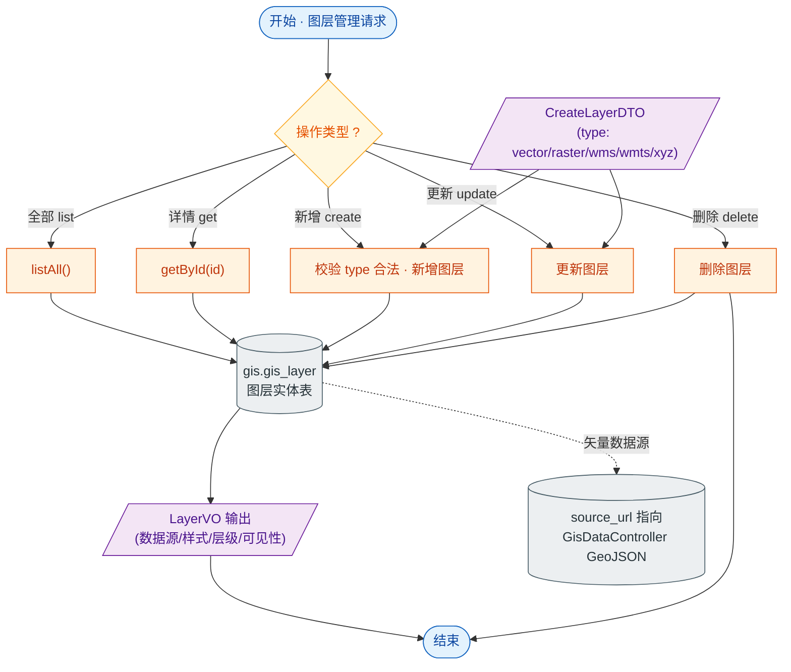

# 接口文档 · LayerController（图层管理）

> 遵循《接口文档生成规范》。
>
> - 基础路径（@RequestMapping）：`/api/layers`
> - 统一返回包装：`Result<T>`
> - 对应服务：`ILayerService`
> - 业务定位：GIS 地图图层的增删改查。图层定义数据源（矢量/栅格/WMS/WMTS/XYZ）、样式、层级与可见性，供前端地图按配置加载。

---

## 一、Controller 功能表

| 类功能 | Layer 功能（地图图层列表、详情、增改删） |
| --- | --- |
| **方法一** | `list()` |
| | 功能：查询全部图层 |
| | 输入：无 |
| | 输出：`Result<List<LayerVO>>` —— 图层列表 |
| | 路由：`GET /api/layers` |
| **方法二** | `get(Long id)` |
| | 功能：查询图层详情 |
| | 输入：路径参数 `id` |
| | 输出：`Result<LayerVO>` —— 图层详情 |
| | 路由：`GET /api/layers/{id}` |
| **方法三** | `create(CreateLayerDTO)` |
| | 功能：新增图层 |
| | 输入：请求体 `CreateLayerDTO`（name、code、type、sourceUrl、style、visible、zIndex 等） |
| | 输出：`Result<LayerVO>` —— 新建后的图层 |
| | 路由：`POST /api/layers` |
| **方法四** | `update(Long id, CreateLayerDTO)` |
| | 功能：更新图层（复用创建 DTO） |
| | 输入：路径参数 `id`；请求体 `CreateLayerDTO` |
| | 输出：`Result<LayerVO>` —— 更新后的图层 |
| | 路由：`PUT /api/layers/{id}` |
| **方法五** | `delete(Long id)` |
| | 功能：删除图层 |
| | 输入：路径参数 `id` |
| | 输出：`Result<Void>` —— 空数据，仅业务码 |
| | 路由：`DELETE /api/layers/{id}` |

---

## 二、功能流程结构图

> 形状约定：圆角=开始/结束，矩形=处理，**棱形=判断/分支**，平行四边形=输入/输出，圆柱=数据存储。

---

## 三、Entity 实体表 · Layer（表 `gis.gis_layer`）

> 继承 `BaseEntity`：id / deleted / createdAt / updatedAt。

| 字段 | 类型 | 列名 / 约束 | 说明 |
| --- | --- | --- | --- |
| id | Long | 主键，自增 | 主键（继承 BaseEntity） |
| deleted | Boolean | `deleted`，默认 false | 软删除标记（继承 BaseEntity） |
| createdAt | OffsetDateTime | `created_at`，不可更新 | 创建时间（继承 BaseEntity） |
| updatedAt | OffsetDateTime | `updated_at` | 更新时间（继承 BaseEntity） |
| name | String | 非空、长度 128 | 图层名称 |
| code | String | 唯一、非空、长度 64 | 图层编码 |
| type | String | 非空、长度 32 | 类型：vector/raster/wms/wmts/xyz |
| sourceUrl | String | `source_url`，长度 512 | 数据源地址（可指向本系统 GeoJSON 接口） |
| workspace | String | 长度 64 | GeoServer 工作区 |
| layerName | String | `layer_name`，长度 128 | 服务端图层名 |
| style | String | 长度 128 | 样式名 |
| visible | Boolean | 非空，默认 true | 默认是否可见 |
| zIndex | Integer | `z_index`，非空，默认 0 | 图层层级 |
| extent | Polygon | `geometry(Polygon,4326)` | 图层范围（可空） |
| description | String | 长度 512 | 描述 |

---

## 四、关联 DTO / VO

### 入参 · CreateLayerDTO（创建/更新图层请求体）

| 字段 | 类型 | 校验 | 说明 |
| --- | --- | --- | --- |
| name | String | `@NotBlank` | 图层名称，必填 |
| code | String | `@NotBlank` | 图层编码，必填 |
| type | String | `@NotBlank` `@Pattern(vector\|raster\|wms\|wmts\|xyz)` | 图层类型，必填且限定枚举 |
| sourceUrl | String | — | 数据源地址 |
| workspace | String | — | GeoServer 工作区 |
| layerName | String | — | 服务端图层名 |
| style | String | — | 样式名 |
| visible | Boolean | — | 默认可见，默认 true |
| zIndex | Integer | — | 图层层级，默认 0 |
| description | String | — | 描述 |

> 注：DTO 不含 `extent`，影响范围由服务端维护。

### 出参 · LayerVO（图层视图对象）

| 字段 | 类型 | 说明 |
| --- | --- | --- |
| id | Long | 图层 id |
| name | String | 图层名称 |
| code | String | 图层编码 |
| type | String | 类型 |
| sourceUrl | String | 数据源地址 |
| workspace | String | GeoServer 工作区 |
| layerName | String | 服务端图层名 |
| style | String | 样式名 |
| visible | Boolean | 默认可见 |
| zIndex | Integer | 图层层级 |
| description | String | 描述 |
