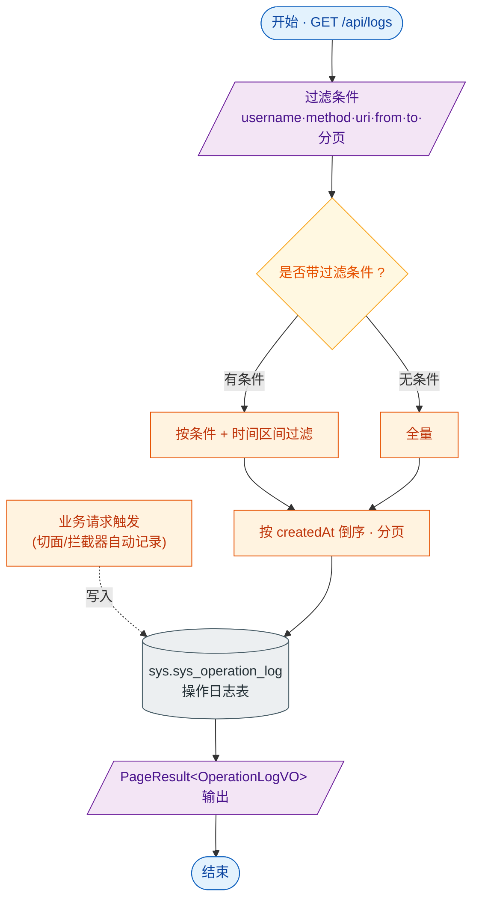

# 接口文档 · OperationLogController（操作日志）

> 遵循《接口文档生成规范》。
>
> - 基础路径（@RequestMapping）：`/api/logs`
> - 统一返回包装：`Result<PageResult<T>>`
> - 对应服务：`IOperationLogService`
> - 业务定位：系统操作审计日志的分页查询（只读）。日志由切面/拦截器写入，本接口仅供审计检索。

---

## 一、Controller 功能表

| 类功能 | OperationLog 功能（操作日志分页查询，多条件过滤） |
| --- | --- |
| **方法一** | `page(String username, String method, String uri, OffsetDateTime from, OffsetDateTime to, int page, int size)` |
| | 功能：分页查询操作日志，按时间倒序，支持按用户名/请求方法/URI/时间区间过滤 |
| | 输入：查询参数 `username`、`method`、`uri`、`from`、`to`（均可空，时间为 ISO 格式）；`page`（默认 1）、`size`（默认 20） |
| | 输出：`Result<PageResult<OperationLogVO>>` —— 分页日志结果 |
| | 路由：`GET /api/logs` |

---

## 二、功能流程结构图

> 形状约定：圆角=开始/结束，矩形=处理，**棱形=判断/分支**，平行四边形=输入/输出，圆柱=数据存储。

---

## 三、Entity 实体表 · OperationLog（表 `sys.sys_operation_log`）

> 注：本实体**未继承** BaseEntity，自带主键 id 与 `@CreatedDate` 审计时间，无软删除/更新时间字段。

| 字段 | 类型 | 列名 / 约束 | 说明 |
| --- | --- | --- | --- |
| id | Long | 主键，自增 | 主键 |
| userId | Long | `user_id` | 操作用户 id |
| username | String | 长度 64 | 操作用户名 |
| module | String | 长度 64 | 业务模块 |
| action | String | 长度 64 | 操作动作 |
| method | String | 长度 16 | HTTP 方法（GET/POST 等） |
| uri | String | 长度 256 | 请求 URI |
| ip | String | 长度 64 | 来源 IP |
| resultCode | Integer | `result_code` | 业务结果码 |
| costMs | Long | `cost_ms` | 耗时（毫秒） |
| createdAt | OffsetDateTime | `created_at`，不可更新，`@CreatedDate` | 记录时间 |

---

## 四、关联 DTO / VO

> 本模块仅查询，无入参 DTO；过滤条件以独立查询参数传入。

### 出参 · OperationLogVO（操作日志视图对象）

| 字段 | 类型 | 说明 |
| --- | --- | --- |
| id | Long | 日志 id |
| userId | Long | 操作用户 id |
| username | String | 操作用户名 |
| module | String | 业务模块 |
| action | String | 操作动作 |
| method | String | HTTP 方法 |
| uri | String | 请求 URI |
| ip | String | 来源 IP |
| resultCode | Integer | 业务结果码 |
| costMs | Long | 耗时（毫秒） |
| createdAt | OffsetDateTime | 记录时间 |

### 查询参数说明

| 参数 | 类型 | 说明 |
| --- | --- | --- |
| username | String | 按用户名过滤 |
| method | String | 按 HTTP 方法过滤 |
| uri | String | 按请求 URI 过滤 |
| from | OffsetDateTime | 起始时间（ISO 格式） |
| to | OffsetDateTime | 结束时间（ISO 格式） |
| page | int | 页码，默认 1 |
| size | int | 每页条数，默认 20 |
