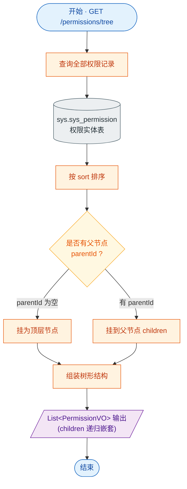

# 接口文档 · PermissionController（权限管理）

> 遵循《接口文档生成规范》。
>
> - 基础路径（@RequestMapping）：`/api/permissions`
> - 统一返回包装：`Result<T>`
> - 对应服务：`IPermissionService`
> - 业务定位：以树形结构输出系统权限（菜单/按钮），供前端构建菜单与角色授权勾选。

---

## 一、Controller 功能表

| 类功能 | Permission 功能（权限树查询） |
| --- | --- |
| **方法一** | `tree()` |
| | 功能：查询全部权限并组装成树形结构（按 parentId 嵌套、sort 排序） |
| | 输入：无 |
| | 输出：`Result<List<PermissionVO>>` —— 顶层权限列表，子节点在 `children` 内递归 |
| | 路由：`GET /api/permissions/tree` |

---

## 二、功能流程结构图

> 形状约定：圆角=开始/结束，矩形=处理，**棱形=判断/分支**，平行四边形=输入/输出，圆柱=数据存储。

---

## 三、Entity 实体表 · Permission（表 `sys.sys_permission`）

> 继承 `BaseEntity`：id / deleted / createdAt / updatedAt。

| 字段 | 类型 | 列名 / 约束 | 说明 |
| --- | --- | --- | --- |
| id | Long | 主键，自增 | 主键（继承 BaseEntity） |
| deleted | Boolean | `deleted`，默认 false | 软删除标记（继承 BaseEntity） |
| createdAt | OffsetDateTime | `created_at`，不可更新 | 创建时间（继承 BaseEntity） |
| updatedAt | OffsetDateTime | `updated_at` | 更新时间（继承 BaseEntity） |
| name | String | 非空、长度 64 | 权限名称 |
| code | String | 唯一、非空、长度 128 | 权限编码 |
| type | Short | 非空，默认 1 | 类型（如 1 菜单 / 按钮 等） |
| parentId | Long | `parent_id` | 父权限 id（树形结构用，顶层为空） |
| path | String | 长度 256 | 前端路由路径 |
| icon | String | 长度 64 | 菜单图标 |
| sort | Integer | 非空，默认 0 | 排序值 |

---

## 四、关联 DTO / VO

> PermissionController 仅有查询接口，无入参 DTO。

### 出参 · PermissionVO（权限视图对象，树形）

| 字段 | 类型 | 说明 |
| --- | --- | --- |
| id | Long | 权限 id |
| name | String | 权限名称 |
| code | String | 权限编码 |
| type | Short | 类型（菜单/按钮等） |
| parentId | Long | 父权限 id |
| path | String | 前端路由路径 |
| icon | String | 菜单图标 |
| sort | Integer | 排序值 |
| children | List\<PermissionVO\> | 子权限列表（递归嵌套，构成树） |
