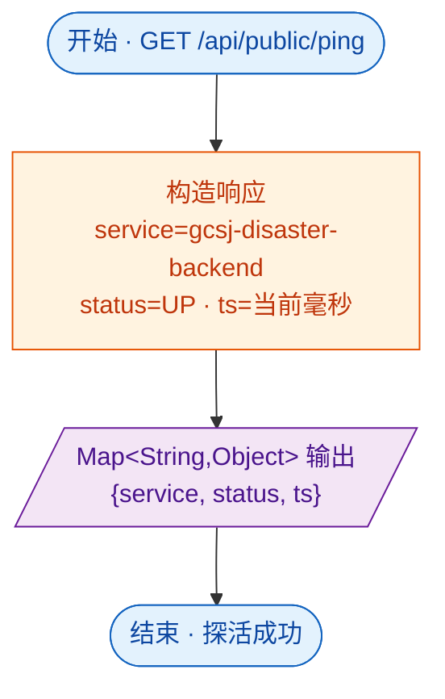

# 接口文档 · PublicController（公开接口）

> 遵循《接口文档生成规范》。
>
> - 基础路径（@RequestMapping）：`/api/public`
> - 统一返回包装：`Result<T>`
> - 对应服务：无（Controller 内直接构造返回，不依赖 Service）
> - 业务定位：无需登录的公开接口，目前仅服务健康检查，供负载均衡/监控探活。

---

## 一、Controller 功能表

| 类功能 | Public 功能（无需鉴权的公开接口 — 健康检查） |
| --- | --- |
| **方法一** | `ping()` |
| | 功能：服务健康检查，返回服务名、状态、时间戳 |
| | 输入：无 |
| | 输出：`Result<Map<String,Object>>` —— `{service, status:"UP", ts}` |
| | 路由：`GET /api/public/ping` |

---

## 二、功能流程结构图

> 形状约定：圆角=开始/结束，矩形=处理，**棱形=判断/分支**，平行四边形=输入/输出，圆柱=数据存储。

> 说明：本接口无分支判断、不访问数据库，直接在内存中构造返回，是全项目最简单的接口（无鉴权、无 Service、无实体）。

---

## 三、Entity 实体表

> PublicController **无对应实体**，不访问数据库，直接构造 `Map` 返回。

---

## 四、关联 DTO / VO

> 无入参 DTO、无自定义 VO。

### 输出结构 · ping 响应（Map）

| 字段 | 类型 | 说明 |
| --- | --- | --- |
| service | String | 服务名，固定 "gcsj-disaster-backend" |
| status | String | 服务状态，固定 "UP" |
| ts | Long | 当前时间戳（毫秒，`System.currentTimeMillis()`） |
