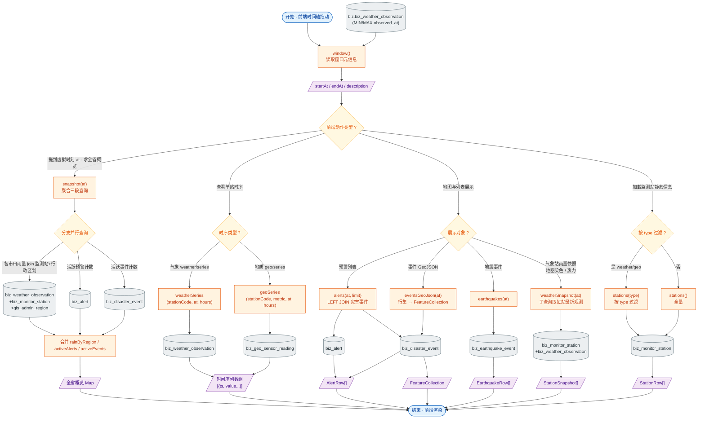

# 接口文档 · ReplayController（时间轴回放）

> 说明：本文档遵循 `接口文档生成规范.md` 统一格式编写。
>
> - 基础路径（@RequestMapping）：`/api/replay`
> - 统一返回包装：`Result<T>`（业务码 + 数据）
> - 数据来源：`spatial_analyse/replay_data_gen.py` 离线生成的 2022-09-05~07 四川泸定 6.8 级地震模拟回放数据
> - 实现策略：故意用 `JdbcTemplate` 直查多表，**不走 entity / service / repository 三件套**——预警与事件在 Python 端规则引擎已离线计算入库，后端只做"按虚拟时刻过滤"的查询服务

---

## 一、Controller 功能表

| 类功能 | Replay 功能（基于虚拟时间线对模拟数据进行切片，向前端供给地图、时序、预警与事件的回放快照） |
| --- | --- |
| **方法一** | `window()` |
| | 功能：返回回放数据窗口元信息（起止时间、总观测条数、说明），用于前端时间轴控件初始化 |
| | 输入：无 |
| | 输出：`Result<Map<String,Object>>` —— `{ startAt, endAt, description }` |
| | 路由：`GET /api/replay/window` |
| **方法二** | `snapshot(OffsetDateTime at)` |
| | 功能：取某虚拟时刻的全省概览：各市州最近 1h/24h 平均雨强 + 当前活跃预警数 + 当前已发生事件数 |
| | 输入：查询参数 `at`（虚拟时刻 ISO-8601） |
| | 输出：`Result<Map<String,Object>>` —— `{ at, rainByRegion[], activeAlerts, activeEvents }` |
| | 路由：`GET /api/replay/snapshot` |
| **方法三** | `weatherSeries(String stationCode, OffsetDateTime at, int hours)` |
| | 功能：单气象站最近 N 小时（默认 24h）观测时序，供 ECharts 折线图绘制 |
| | 输入：查询参数 `stationCode`、`at`、`hours`（默认 24） |
| | 输出：`Result<List<Map<String,Object>>>` —— `[{ ts, rainfall_1h, rainfall_24h, temperature, humidity }, ...]` |
| | 路由：`GET /api/replay/weather/series` |
| **方法四** | `geoSeries(String stationCode, String metric, OffsetDateTime at, int hours)` |
| | 功能：地质传感器单站单指标的时序（位移 / 含水率 / 倾斜 / 裂缝 等任选一个） |
| | 输入：查询参数 `stationCode`、`metric`、`at`、`hours`（默认 24） |
| | 输出：`Result<List<Map<String,Object>>>` —— `[{ ts, value, is_anomaly }, ...]` |
| | 路由：`GET /api/replay/geo/series` |
| **方法五** | `alerts(OffsetDateTime at, int limit)` |
| | 功能：截止虚拟时刻的活跃预警列表（含经纬度与关联事件类型/区划） |
| | 输入：查询参数 `at`、`limit`（默认 100） |
| | 输出：`Result<List<Map<String,Object>>>` —— 预警行集 |
| | 路由：`GET /api/replay/alerts` |
| **方法六** | `eventsGeoJson(OffsetDateTime at)` |
| | 功能：截止虚拟时刻的灾害事件 GeoJSON（点要素），供 OpenLayers 矢量图层渲染 |
| | 输入：查询参数 `at` |
| | 输出：`Result<Map<String,Object>>` —— `FeatureCollection { type, features[] }` |
| | 路由：`GET /api/replay/events/geojson` |
| **方法七** | `earthquakes(OffsetDateTime at)` |
| | 功能：截止虚拟时刻的地震事件列表（主震 + 余震 + 背景震），含震源位置/震级/深度 |
| | 输入：查询参数 `at` |
| | 输出：`Result<List<Map<String,Object>>>` —— 地震行集 |
| | 路由：`GET /api/replay/earthquakes` |
| **方法八** | `weatherSnapshot(OffsetDateTime at)` |
| | 功能：全省气象站某虚拟时刻雨量快照，供地图染色 + 热力层 |
| | 输入：查询参数 `at` |
| | 输出：`Result<List<Map<String,Object>>>` —— 各站点最近一次观测（含坐标 + 多要素） |
| | 路由：`GET /api/replay/weather/snapshot` |
| **方法九** | `stations(String type)` |
| | 功能：监测站列表（不随时间变化），可按 `type` 过滤（weather / geo） |
| | 输入：查询参数 `type`（可空） |
| | 输出：`Result<List<Map<String,Object>>>` —— 监测站行集 |
| | 路由：`GET /api/replay/stations` |

---

## 二、功能流程结构图

> 形状约定：圆角=开始/结束，矩形=处理步骤，**棱形=判断/分支**，平行四边形=输入/输出，圆柱=数据存储。

---

## 三、Entity 实体表

> ReplayController **不绑定单一实体**，使用 `JdbcTemplate` 跨多张表直查。涉及到的核心表如下，字段以 `replay_data_gen.py` 的建表/写入脚本为准。

### 3.1 `biz.biz_weather_observation` · 气象观测时序

| 字段 | 类型 | 列名 / 约束 | 说明 |
| --- | --- | --- | --- |
| stationCode | String | `station_code` | 气象站编码（外键到 `biz_monitor_station.code`） |
| observedAt | OffsetDateTime | `observed_at`，非空，与 station 联合唯一 | 观测时刻（小时粒度） |
| rainfall1h | Double | `rainfall_1h` | 1 小时降雨量 mm |
| rainfall24h | Double | `rainfall_24h` | 24 小时累计降雨量 mm |
| temperature | Double | `temperature` | 气温 ℃ |
| humidity | Double | `humidity` | 相对湿度 % |
| windSpeed | Double | `wind_speed` | 风速 m/s |
| windDir | Short | `wind_dir` | 风向（°） |
| pressure | Double | `pressure` | 气压 hPa |

### 3.2 `biz.biz_geo_sensor_reading` · 地质传感器时序

| 字段 | 类型 | 列名 / 约束 | 说明 |
| --- | --- | --- | --- |
| stationCode | String | `station_code` | 地质监测站编码 |
| metricType | String | `metric_type` | 指标：displacement / soil_moisture / tilt / crack |
| observedAt | OffsetDateTime | `observed_at`，10 分钟粒度 | 观测时刻 |
| value | Double | `value` | 读数 |
| isAnomaly | Boolean | `is_anomaly`，默认 false | 阈值越界标记（Python 端预算好） |

### 3.3 `biz.biz_monitor_station` · 监测站静态信息

| 字段 | 类型 | 列名 / 约束 | 说明 |
| --- | --- | --- | --- |
| code | String | `code`，唯一 | 站码 |
| name | String | `name` | 站名 |
| type | String | `type` | 类型：weather / geo |
| regionCode | String | `region_code` | 行政区划 adcode（关联 `gis.gis_admin_region.adcode`） |
| location | Point | `geometry(Point, 4326)` | 经纬度 |
| elevation | Double | `elevation` | 高程 m |

### 3.4 `biz.biz_alert` · 预警实体（详见 AlertController 文档）

> 本控制器只读：`id, code, title, content, level, source, triggered_at, event_id, location, deleted`，并由 `LEFT JOIN biz_disaster_event` 带出事件类型与区划。

### 3.5 `biz.biz_disaster_event` · 灾害事件

| 字段 | 类型 | 列名 / 约束 | 说明 |
| --- | --- | --- | --- |
| id | Long | 主键 | |
| code | String | `code` | 事件编号 |
| title | String | `title` | 事件标题 |
| type | String | `type` | 灾种：landslide / flood / debris_flow / collapse 等 |
| level | Short | `level` | 等级 1~4 |
| regionCode | String | `region_code` | 行政区划 |
| occurredAt | OffsetDateTime | `occurred_at`，非空 | 发生时刻 |
| location | Point | `geometry(Point, 4326)` | 发生位置 |
| description | String | text | 描述 |
| deleted | Boolean | `deleted`，默认 false | 软删 |

### 3.6 `biz.biz_earthquake_event` · 地震事件

| 字段 | 类型 | 列名 / 约束 | 说明 |
| --- | --- | --- | --- |
| id | Long | 主键 | |
| code | String | `code` | 地震编号 |
| occurredAt | OffsetDateTime | `occurred_at`，非空 | 发震时刻（UTC） |
| magnitude | Double | `magnitude` | 震级 M |
| depthKm | Double | `depth_km` | 震源深度 km |
| epicenter | Point | `geometry(Point, 4326)` | 震中坐标 |
| locationName | String | `location_name` | 文字位置（如"四川泸定"） |
| regionCode | String | `region_code` | 行政区划 |

### 3.7 `gis.gis_admin_region` · 行政区划

> 仅在 `snapshot` 中作为关联表使用，按 `adcode` 与监测站做 join，取 `name` 作为市州名。

| 字段 | 类型 | 说明 |
| --- | --- | --- |
| adcode | String | 行政区划编码（市州 / 县区） |
| name | String | 区划名称 |
| level | Short | 行政层级（2 市州 / 3 县区） |

---

## 四、关联 DTO / VO

> 本控制器**全部使用 `Map<String,Object>` 直出**，未定义 DTO/VO 类。下面按"接口语义"列出每个返回结构的字段说明，便于前端类型化（建议在前端 `api/replay.js` 处建立 TS interface 或 JSDoc）。

### 4.1 入参 · 通用查询参数

| 字段 | 类型 | 校验 | 说明 |
| --- | --- | --- | --- |
| at | OffsetDateTime | 由 Spring 自动转换；建议前端用 ISO-8601（含时区） | 虚拟时刻；约束：`window.startAt ≤ at ≤ window.endAt` |
| stationCode | String | — | 监测站 code（来自 `stations` 接口） |
| metric | String | 仅 `geo/series`：枚举 displacement / soil_moisture / tilt / crack | 地质指标类型 |
| hours | int | 默认 24，建议 1~168 | 回看小时数 |
| limit | int | 默认 100；建议 ≤ 500 | 返回条数上限 |
| type | String | 可空；枚举 weather / geo | 监测站类型过滤 |

### 4.2 出参 · `WindowVO`（`/window`）

| 字段 | 类型 | 说明 |
| --- | --- | --- |
| startAt | OffsetDateTime | 回放数据起始时刻 |
| endAt | OffsetDateTime | 回放数据结束时刻 |
| description | String | 文案，固定为"2022-09-05 ~ 09-07 四川泸定 6.8 级地震窗口" |

### 4.3 出参 · `SnapshotVO`（`/snapshot`）

| 字段 | 类型 | 说明 |
| --- | --- | --- |
| at | OffsetDateTime | 回显的虚拟时刻 |
| rainByRegion | List\<RegionRain\> | 各市州雨量数组 |
| activeAlerts | int | 截止 `at` 已触发且未撤回的预警数 |
| activeEvents | int | 截止 `at` 已发生的灾害事件数 |

`RegionRain`：

| 字段 | 类型 | 说明 |
| --- | --- | --- |
| region_code | String | 市州 adcode |
| region_name | String | 市州名 |
| rainfall_1h | Double | 各站 1h 雨量平均 |
| rainfall_24h | Double | 各站 24h 雨量平均 |

### 4.4 出参 · `WeatherSeriesPoint`（`/weather/series`）

| 字段 | 类型 | 说明 |
| --- | --- | --- |
| ts | OffsetDateTime | 观测时刻（即 `observed_at`） |
| rainfall_1h | Double | 1h 降雨 mm |
| rainfall_24h | Double | 24h 降雨 mm |
| temperature | Double | 气温 ℃ |
| humidity | Double | 湿度 % |

### 4.5 出参 · `GeoSeriesPoint`（`/geo/series`）

| 字段 | 类型 | 说明 |
| --- | --- | --- |
| ts | OffsetDateTime | 观测时刻 |
| value | Double | 该指标读数 |
| is_anomaly | Boolean | 阈值越界标记 |

### 4.6 出参 · `AlertRow`（`/alerts`）

| 字段 | 类型 | 说明 |
| --- | --- | --- |
| id | Long | 预警 id |
| code | String | 预警编号 |
| title | String | 标题 |
| content | String | 内容 |
| level | Short | 等级 1~4 |
| source | String | 来源 manual / event / external |
| triggered_at | OffsetDateTime | 触发时间 |
| event_id | Long | 关联事件 id（可空） |
| lon | Double | 经度（PostGIS `ST_X`） |
| lat | Double | 纬度（PostGIS `ST_Y`） |
| event_type | String | 关联事件灾种（LEFT JOIN 来源） |
| region_code | String | 关联事件行政区划 |

### 4.7 出参 · `EventGeoJsonFC`（`/events/geojson`）

GeoJSON `FeatureCollection`，每个 `Feature.properties` 包含：

| 字段 | 类型 | 说明 |
| --- | --- | --- |
| id | Long | 事件 id |
| code | String | 事件编号 |
| title | String | 标题 |
| type | String | 灾种 |
| level | Short | 等级 |
| regionCode | String | 行政区划 |
| occurredAt | OffsetDateTime | 发生时间 |
| description | String | 描述 |

`Feature.geometry`：`{ type: "Point", coordinates: [lon, lat] }`

### 4.8 出参 · `EarthquakeRow`（`/earthquakes`）

| 字段 | 类型 | 说明 |
| --- | --- | --- |
| id | Long | 地震 id |
| code | String | 地震编号 |
| occurred_at | OffsetDateTime | 发震时刻 |
| magnitude | Double | 震级 M |
| depth_km | Double | 震源深度 km |
| lon | Double | 震中经度 |
| lat | Double | 震中纬度 |
| location_name | String | 位置文字 |
| region_code | String | 行政区划 |

### 4.9 出参 · `WeatherSnapshotRow`（`/weather/snapshot`）

| 字段 | 类型 | 说明 |
| --- | --- | --- |
| code | String | 站码 |
| name | String | 站名 |
| region_code | String | 行政区划 |
| lon | Double | 经度 |
| lat | Double | 纬度 |
| rainfall_1h | Double | 1h 降雨 |
| rainfall_24h | Double | 24h 降雨 |
| temperature | Double | 气温 |
| humidity | Double | 湿度 |
| wind_speed | Double | 风速 |

### 4.10 出参 · `StationRow`（`/stations`）

| 字段 | 类型 | 说明 |
| --- | --- | --- |
| code | String | 站码 |
| name | String | 站名 |
| type | String | weather / geo |
| region_code | String | 行政区划 adcode |
| lon | Double | 经度 |
| lat | Double | 纬度 |
| elevation | Double | 高程 m |

---

## 五、设计说明（按 controller 语义补充）

1. **故意不走分层**：本模块定位为"演示回放服务"，数据全部由 Python 端预算好，后端零业务，所以放弃 entity/service/repo，直接 `JdbcTemplate` 写 SQL。如未来要接入真实流式数据，再按规范重构为 `IReplayService` + Repository。
2. **虚拟时间过滤**：所有"按时刻"接口（snapshot / alerts / events / earthquakes / weatherSnapshot）都通过 `WHERE 时间字段 <= at` 实现切片。`weatherSnapshot` 用了相关子查询取每个站点 `observed_at <= at` 的最新一条，避免引入窗口函数依赖。
3. **PostGIS 字段**：所有空间字段用 `ST_X(geom)` / `ST_Y(geom)` 拆出经纬度，前端直接拿到数字而不是 WKT。
4. **GeoJSON 拼装**：`eventsGeoJson` 在后端拼好 FeatureCollection，省去前端二次转换；预警接口 `/alerts` 不走 GeoJSON，是因为前端常以列表形式渲染并附带跳转操作。
5. **限流建议**：`weatherSnapshot` 在 `at` 较晚时会走全表"取每站最新一条"的子查询，建议给 `(station_code, observed_at)` 建联合索引；前端 `at` 大幅跳变时配合防抖（≥ 500ms）。
