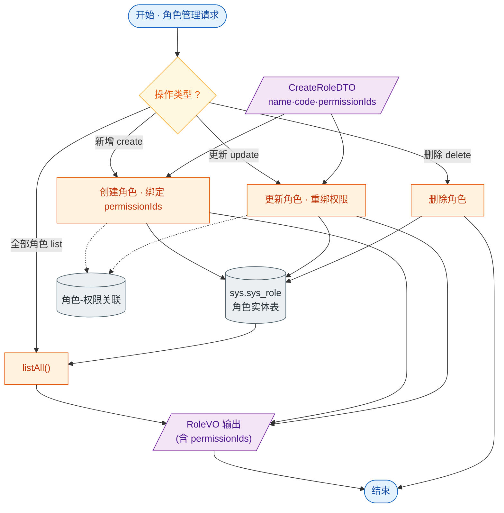

# 接口文档 · RoleController（角色管理）

> 遵循《接口文档生成规范》。
>
> - 基础路径（@RequestMapping）：`/api/roles`
> - 统一返回包装：`Result<T>`
> - 对应服务：`IRoleService`
> - 业务定位：角色的查询与增删改，角色关联权限（permissionIds），是 RBAC 权限体系的中间层。

---

## 一、Controller 功能表

| 类功能 | Role 功能（角色列表、新增、更新、删除，含权限关联） |
| --- | --- |
| **方法一** | `list()` |
| | 功能：查询全部角色 |
| | 输入：无 |
| | 输出：`Result<List<RoleVO>>` —— 角色列表 |
| | 路由：`GET /api/roles` |
| **方法二** | `create(CreateRoleDTO)` |
| | 功能：新增角色并关联权限 |
| | 输入：请求体 `CreateRoleDTO`（name、code、description、permissionIds） |
| | 输出：`Result<RoleVO>` —— 新建后的角色 |
| | 路由：`POST /api/roles` |
| **方法三** | `update(Long id, CreateRoleDTO)` |
| | 功能：更新角色信息与权限关联（复用创建 DTO） |
| | 输入：路径参数 `id`；请求体 `CreateRoleDTO` |
| | 输出：`Result<RoleVO>` —— 更新后的角色 |
| | 路由：`PUT /api/roles/{id}` |
| **方法四** | `delete(Long id)` |
| | 功能：删除角色 |
| | 输入：路径参数 `id` |
| | 输出：`Result<Void>` —— 空数据，仅业务码 |
| | 路由：`DELETE /api/roles/{id}` |

---

## 二、功能流程结构图

> 形状约定：圆角=开始/结束，矩形=处理，**棱形=判断/分支**，平行四边形=输入/输出，圆柱=数据存储。

---

## 三、Entity 实体表 · Role（表 `sys.sys_role`）

> 继承 `BaseEntity`：id / deleted / createdAt / updatedAt。

| 字段 | 类型 | 列名 / 约束 | 说明 |
| --- | --- | --- | --- |
| id | Long | 主键，自增 | 主键（继承 BaseEntity） |
| deleted | Boolean | `deleted`，默认 false | 软删除标记（继承 BaseEntity） |
| createdAt | OffsetDateTime | `created_at`，不可更新 | 创建时间（继承 BaseEntity） |
| updatedAt | OffsetDateTime | `updated_at` | 更新时间（继承 BaseEntity） |
| name | String | 非空、长度 64 | 角色名称 |
| code | String | 唯一、非空、长度 64 | 角色编码 |
| description | String | 长度 256 | 角色描述 |

> 注：角色与权限多对多关联（`permissionIds`）通过中间关联表维护，不在 Role 表内。

---

## 四、关联 DTO / VO

### 入参 · CreateRoleDTO（创建/更新角色请求体）

| 字段 | 类型 | 校验 | 说明 |
| --- | --- | --- | --- |
| name | String | `@NotBlank` | 角色名称，必填 |
| code | String | `@NotBlank` | 角色编码，必填 |
| description | String | — | 角色描述 |
| permissionIds | Set\<Long\> | — | 关联权限 id 集合 |

### 出参 · RoleVO（角色视图对象）

| 字段 | 类型 | 说明 |
| --- | --- | --- |
| id | Long | 角色 id |
| name | String | 角色名称 |
| code | String | 角色编码 |
| description | String | 角色描述 |
| permissionIds | List\<Long\> | 关联权限 id 列表 |
