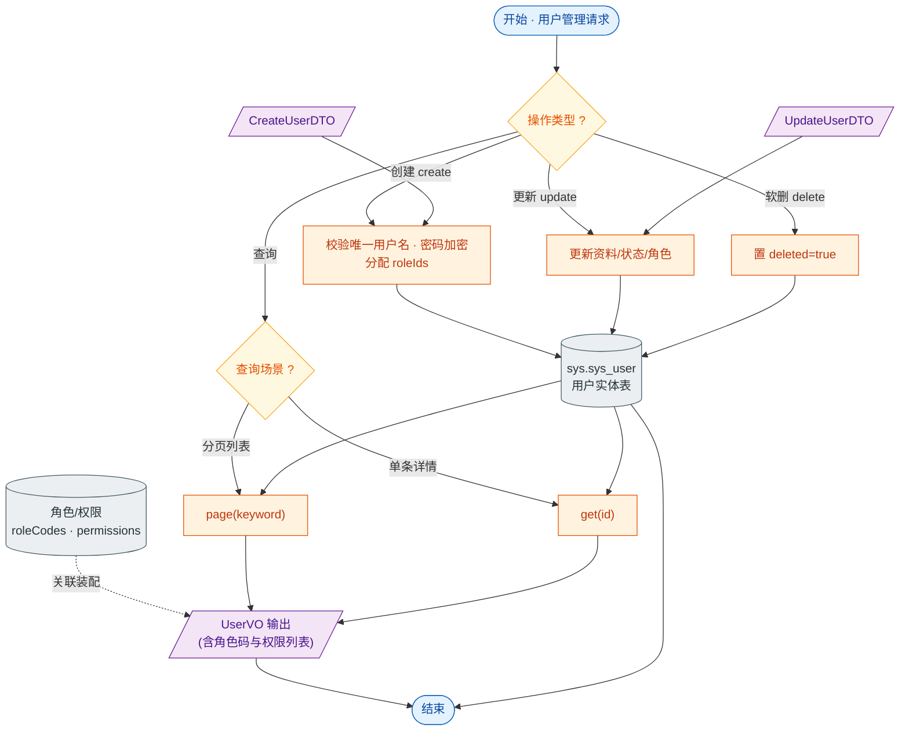

# 接口文档 · UserController（用户管理）

> 遵循《接口文档生成规范》。
>
> - 基础路径（@RequestMapping）：`/api/users`
> - 统一返回包装：`Result<T>`；分页返回 `Result<PageResult<T>>`
> - 对应服务：`IUserService`
> - 业务定位：系统用户的增删改查（删除为软删），并附带角色/权限信息输出。

---

## 一、Controller 功能表

| 类功能 | User 功能（系统用户的分页查询、详情、创建、更新、软删除） |
| --- | --- |
| **方法一** | `page(String keyword, int page, int size)` |
| | 功能：按关键字分页查询用户，默认按 id 倒序 |
| | 输入：查询参数 `keyword`（可空）；`page`（默认 1）、`size`（默认 10） |
| | 输出：`Result<PageResult<UserVO>>` —— 分页结果 |
| | 路由：`GET /api/users` |
| **方法二** | `get(Long id)` |
| | 功能：查询单个用户详情（含角色码与权限列表） |
| | 输入：路径参数 `id` |
| | 输出：`Result<UserVO>` —— 用户详情 |
| | 路由：`GET /api/users/{id}` |
| **方法三** | `create(CreateUserDTO)` |
| | 功能：创建用户（含用户名、密码、角色分配） |
| | 输入：请求体 `CreateUserDTO`（username、password、realName、phone、email、roleIds） |
| | 输出：`Result<UserVO>` —— 新建后的用户详情 |
| | 路由：`POST /api/users` |
| **方法四** | `update(Long id, UpdateUserDTO)` |
| | 功能：更新用户资料、状态与角色 |
| | 输入：路径参数 `id`；请求体 `UpdateUserDTO`（realName、phone、email、status、roleIds） |
| | 输出：`Result<UserVO>` —— 更新后的用户详情 |
| | 路由：`PUT /api/users/{id}` |
| **方法五** | `delete(Long id)` |
| | 功能：删除用户（软删，置 deleted 标记） |
| | 输入：路径参数 `id` |
| | 输出：`Result<Void>` —— 空数据，仅业务码 |
| | 路由：`DELETE /api/users/{id}` |

---

## 二、功能流程结构图

> 形状约定：圆角=开始/结束，矩形=处理，**棱形=判断/分支**，平行四边形=输入/输出，圆柱=数据存储。

---

## 三、Entity 实体表 · User（表 `sys.sys_user`）

> 继承 `BaseEntity`：id / deleted / createdAt / updatedAt。

| 字段 | 类型 | 列名 / 约束 | 说明 |
| --- | --- | --- | --- |
| id | Long | 主键，自增 | 主键（继承 BaseEntity） |
| deleted | Boolean | `deleted`，默认 false | 软删除标记（继承 BaseEntity） |
| createdAt | OffsetDateTime | `created_at`，不可更新 | 创建时间（继承 BaseEntity） |
| updatedAt | OffsetDateTime | `updated_at` | 更新时间（继承 BaseEntity） |
| username | String | 唯一、非空、长度 64 | 登录用户名 |
| password | String | 非空、长度 128 | 密码（加密存储） |
| realName | String | `real_name`，长度 64 | 真实姓名 |
| phone | String | 长度 32 | 手机号 |
| email | String | 长度 128 | 邮箱 |
| avatar | String | 长度 256 | 头像 URL |
| status | Short | 非空，默认 1 | 状态（1 启用 等） |
| lastLoginAt | OffsetDateTime | `last_login_at` | 最近登录时间 |

> 注：角色/权限（`roleCodes`、`permissions`）不在 User 表内,由角色关联在 VO 装配阶段写入。

---

## 四、关联 DTO / VO

### 入参 · CreateUserDTO（创建用户请求体）

| 字段 | 类型 | 校验 | 说明 |
| --- | --- | --- | --- |
| username | String | `@NotBlank` `@Size(3,64)` | 用户名，必填 |
| password | String | `@NotBlank` `@Size(6,64)` | 密码，必填 |
| realName | String | `@Size(max=64)` | 真实姓名 |
| phone | String | `@Pattern(^[0-9+\-]{6,32}$)` | 手机号，格式校验 |
| email | String | `@Email` | 邮箱 |
| roleIds | Set\<Long\> | — | 分配的角色 id 集合 |

### 入参 · UpdateUserDTO（更新用户请求体）

| 字段 | 类型 | 校验 | 说明 |
| --- | --- | --- | --- |
| realName | String | `@Size(max=64)` | 真实姓名 |
| phone | String | `@Pattern(^[0-9+\-]{6,32}$)` | 手机号 |
| email | String | `@Email` | 邮箱 |
| status | Short | — | 用户状态 |
| roleIds | Set\<Long\> | — | 角色 id 集合 |

### 出参 · UserVO（用户视图对象）

| 字段 | 类型 | 说明 |
| --- | --- | --- |
| id | Long | 用户 id |
| username | String | 用户名 |
| realName | String | 真实姓名 |
| phone | String | 手机号 |
| email | String | 邮箱 |
| avatar | String | 头像 URL |
| status | Short | 状态 |
| lastLoginAt | OffsetDateTime | 最近登录时间 |
| createdAt | OffsetDateTime | 创建时间 |
| roleCodes | List\<String\> | 角色编码列表（关联装配） |
| permissions | List\<String\> | 权限列表（关联装配） |
